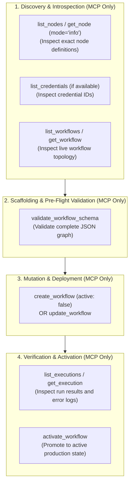

# n8n Architect — Production Workflow Engineering Skill

`n8n-architect` is the authoritative Antigravity skill for architecting, generating, refactoring, and debugging production-grade **n8n workflows**.

> [!IMPORTANT]
> ### Primary Directive: n8n MCP Server First & Only
> The agent **MUST ALWAYS use the connected `n8n-mcp` server tools as the primary, default, and exclusive interface** for all n8n operations whenever interacting with workflows, nodes, credentials, and executions.
> 
> **Never bypass the MCP server** with ad-hoc shell commands, direct database queries, raw curl commands, or speculative JSON generation. If an operation is unsupported by the MCP protocol, STOP and ask the user for clarification. Do not fall back to shell scripts or curl.

---

## 1. Core Architectural Tenets

### A. MCP-First Interaction Protocol
* **Workflow Discovery & Retrieval**: Always invoke `list_workflows` and `get_workflow` to inspect live definitions rather than guessing IDs or inspecting stale local files.
* **Schema-Driven Scaffolding**: Always call `get_node` (with `mode="info"`) to verify parameter names, types, and defaults before constructing or patching any node.
* **Pre-Flight Validation**: Always run `validate_workflow_schema` on the full workflow JSON payload before executing `create_workflow` or `update_workflow`.
* **Zero-Disk Credential Vault Separation**: Never embed raw API tokens, passwords, or secrets into node JSON. Query existing credential IDs using `list_credentials` (if available, otherwise ask the user) and connect nodes by ID.
* **Execution & Diagnostic Traceability**: Inspect workflow runs and error stacks directly via `list_executions` and `get_execution`.

### B. Data Structure & Item-List Protocol
* **Item Array Contract**: Every n8n node consumes and emits an array of paired data objects:
  ```json
  [
    {
      "json": { "id": 101, "status": "active" },
      "binary": { "data": { "data": "base64...", "mimeType": "application/pdf" } }
    }
  ]
  ```
* **Item Pairing & Matching**: Nodes operate element-by-element across the item array. When a downstream node references an upstream node via `$('Node Name').item.json.key`, n8n resolves the value matching the current item's index.
* **Iteration Semantics**: Multi-run nodes (loops, batches) evaluate item state using `$itemIndex` (position within current batch) and `$runIndex` (number of times the node executed in the loop).

### C. Modern Expression Standards (v1+ Only)
* **Strict Prohibition**: Legacy expressions such as `{{ $node["Node Name"].data["key"] }}` or `{{ $node["Node Name"].json["key"] }}` are **strictly deprecated and forbidden**.
* **Modern Canonical Expressions**:
  * Current node item: `{{ $json.property }}`
  * Predecessor item by name: `{{ $('Node Name').item.json.property }}`
  * First / All items: `{{ $('Node Name').first().json.property }}`, `{{ $('Node Name').all() }}`
  * Execution context: `{{ $execution.id }}`, `{{ $execution.mode }}`, `{{ $now }}`, `{{ $workflow.id }}`

### D. Operational Guardrails
1. **MCP Exclusivity**: Use `n8n-mcp` tools first and exclusively for all workflow lifecycle actions.
2. **Safe Staging Policy**: All newly scaffolded workflows must be created with `"active": false` until validation and execution checks succeed.
3. **Queue Mode & Worker Decoupling**: The production architecture operates in `EXECUTIONS_MODE=queue` backed by Redis Bull queues and `n8n-worker` instances. Do not assume synchronous in-process memory persistence between distinct node executions.
4. **Retention Awareness**: Do not retain high-volume binary payloads inside execution data (`EXECUTIONS_DATA_PRUNE=true`).

---

## 2. n8n MCP Tool Registry & Execution Hierarchy

When executing any n8n automation task, follow this strict tool priority:



### Complete MCP Tool Mapping

| Engineering Phase | MCP Tool | Strict Calling Requirement |
| :--- | :--- | :--- |
| **Node Introspection** | `list_nodes` | Query all installed node types and versions available on the server. |
| **Node Introspection** | `get_node` (mode='info') | **Mandatory** before creating/updating any node. Inspect exact parameter keys and types. |
| **Node Schema & Docs** | `get_node` | Fetch structural schema, parameters, default values, and Markdown documentation. |
| **Credential Discovery** | `n8n_manage_credentials` | Retrieve list of available credentials (action: "list") and schema requirements. |
| **Credential Discovery** | `get_credential_schema` | Check required fields and authentication schemes for a credential type. |
| **Workflow Discovery** | `n8n_list_workflows` | **Mandatory** before modifying workflows. List all workflows to verify IDs and status. |
| **Workflow Retrieval** | `n8n_list_workflows` / `n8n_get_workflow` | Fetch existing workflow JSON structures for modification. |
| **Pre-Flight Validation**| `validate_workflow_schema` | **Mandatory** before committing changes. Catches invalid parameters, ports, or expressions. |
| **Workflow Creation** | `n8n_create_workflow` | Primary tool for scaffolding new workflows. Always pass `"active": false`. |
| **Workflow Mutation** | `n8n_update_full_workflow` | Primary tool for updating nodes, connections, or settings on existing workflows. |
| **Workflow Activation** | `activate_workflow` | Use to activate workflow once tests and executions succeed. |
| **Workflow Deactivation**| `deactivate_workflow` | Use to pause or deactivate workflows during maintenance or deprecation. |
| **Workflow Deployment** | `n8n_create_workflow` / `n8n_update_full_workflow` | Deploy or update workflows directly to the server. |
| **Execution Diagnostics**| `n8n_executions` | Query execution history filtered by `workflowId` and status (`success`/`error`). |
| **Execution Diagnostics** | `n8n_executions` | Fetch logs and execution traces (action: "list" or "get"). |
| **Execution Cleanup** | `delete_execution` | Delete individual execution records when needed. |

---

## 3. Operational Execution Protocol (Step-by-Step)

### Step 1: Introspect Schema & Discover Credentials via MCP
1. Call `get_node` (with `mode="info"`) with the target `nodeType` (e.g. `n8n-nodes-base.if`, `n8n-nodes-base.httpRequest`, `@n8n/n8n-nodes-langchain.lmChatOpenAi`).
2. Call `list_credentials` (if available, otherwise ask user) to retrieve the relevant credential ID (e.g. `openAiApi` ID `hvK9eAePdrKHSgMD`) to attach to integration nodes without storing plaintext secrets.

### Step 2: Scaffolding & Canvas Topology Design
1. Structure nodes with consistent canvas positioning (`x += 220-300`, `y += 140-200`).
2. Route connections accurately:
   * Main branches: `"main": [ [ { "node": "Target", "type": "main", "index": 0 } ] ]`
   * Conditional branches: Index `0` (True), Index `1` (False)
   * AI Language Model sub-nodes: `"ai_languageModel"`
3. Configure timeouts and retry policies (e.g., `timeout: 360000` for consumer GPU local AI cold loads).

### Step 3: Validate Workflow Schema via MCP
1. Call `validate_workflow_schema` passing the complete staged JSON.
2. Resolve any missing parameters, invalid operator types, or broken node connection references.

### Step 4: Commit, Test & Activate via MCP
1. For new workflows: Call `create_workflow` with `"active": false`.
2. For existing workflows: Call `get_workflow` -> compute diff -> Call `update_workflow`.
3. Trigger test run and inspect results via `list_executions` / `get_execution`.
4. Once execution succeeds, call `activate_workflow` if the workflow requires active background scheduling or webhooks.

---

## 4. Reference Architecture & Resource Index

Consult the specialized reference guides in `resources/` for detailed implementation patterns:

| Resource Document | Purpose & Scope |
| :--- | :--- |
| **[`expressions-reference.md`](./resources/expressions-reference.md)** | Comprehensive syntax guide for `$json`, `$item`, `$now`, Luxon date operations, JMESPath querying, and binary data handling. |
| **[`core-node-schemas.md`](./resources/core-node-schemas.md)** | Production JSON skeletons and property maps for If, Switch, Code, HTTP Request, Merge, Aggregate, SplitInBatches, and ExecuteWorkflow. |
| **[`workflow-patterns.md`](./resources/workflow-patterns.md)** | Standardized architectural blueprints: Webhook Ingest/Response, API Pagination, Sub-Workflow Callers, and Local AI Inference over Meshnet. |

---

## 5. Node Quick Reference

```
+-------------------------------------------------------------------------------+
| Node Type Identifier                  | Version | Primary Purpose             |
+-------------------------------------------------------------------------------+
| n8n-nodes-base.manualTrigger          | 1.0     | Manual testing trigger      |
| @n8n/n8n-nodes-langchain.chatTrigger  | 1.1     | Interactive canvas chat UI  |
| n8n-nodes-base.webhook                | 2.0     | External HTTP webhook API   |
| n8n-nodes-base.set                    | 3.4     | Variable & field assignment |
| n8n-nodes-base.if                     | 2.3     | Binary condition routing    |
| n8n-nodes-base.switch                 | 3.4     | Multi-branch rule routing   |
| n8n-nodes-base.code                   | 2.0     | Custom JS & Python execution|
| n8n-nodes-base.httpRequest            | 4.5     | External REST/GraphQL API   |
| n8n-nodes-base.merge                  | 3.2     | Combining multiple streams  |
| n8n-nodes-base.splitInBatches         | 3.0     | Loop over items in batches  |
| n8n-nodes-base.aggregate              | 1.0     | Aggregate item arrays       |
| n8n-nodes-base.executeWorkflow        | 1.3     | Sub-workflow orchestration  |
| n8n-nodes-base.errorTrigger           | 1.0     | Global error catch workflow |
| @n8n/n8n-nodes-langchain.agent        | 3.1     | Autonomous AI Agent         |
| @n8n/n8n-nodes-langchain.lmChatOpenAi | 1.3     | OpenAI-compatible LLM model |
+-------------------------------------------------------------------------------+
```
