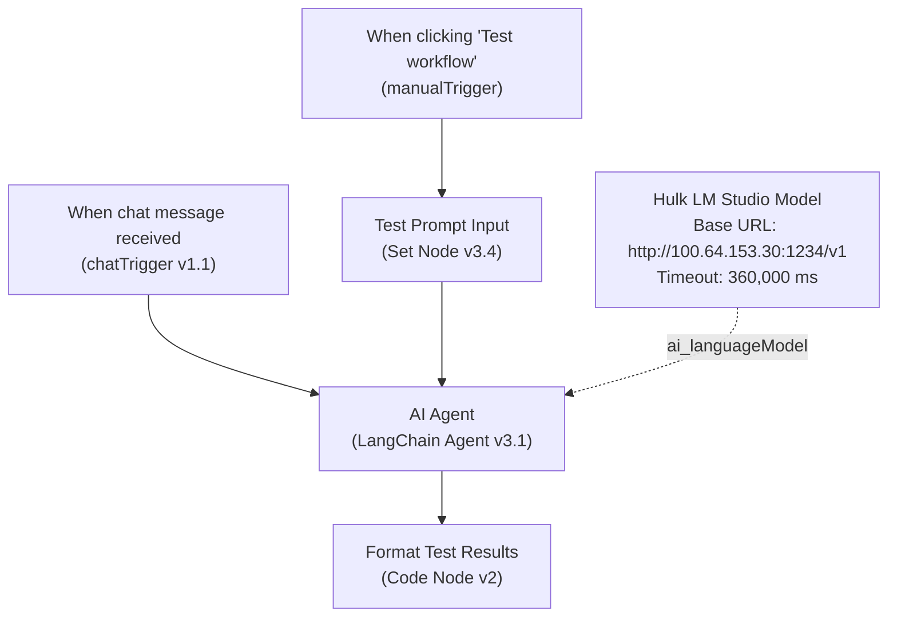

# Production Workflow Patterns & Architectures — n8n

> **Authoritative Source**: Verified against [n8n Workflow Best Practices](https://docs.n8n.io/workflows/) and high-throughput Queue Mode deployment standards.

---

## Pattern 1: Webhook Ingest with Validation & Synchronous Response

### Architecture & Topology
Decouples immediate HTTP acknowledgement from downstream asynchronous processing.

```mermaid
graph TD
    Webhook["Webhook Trigger<br/>(responseMode: 'responseNode')"] --> Validate["Validate Ingest Payload<br/>(If Node v2.3)"]
    
    Validate -->|Valid (Output 0)| RespondOK["Respond 200 OK<br/>(respondToWebhook)"]
    Validate -->|Invalid (Output 1)| RespondErr["Respond 400 Bad Request<br/>(respondToWebhook)"]
    
    RespondOK --> ProcessTask["Async Task Execution<br/>(HTTP / DB / Queue)"]
    ProcessTask --> NotifyDone["Emit Audit Log"]
```

### Complete Workflow JSON Skeleton
```json
{
  "name": "Pattern-Webhook-Ingest-Validate",
  "nodes": [
    {
      "parameters": {
        "httpMethod": "POST",
        "path": "v1-ingest",
        "responseMode": "responseNode",
        "options": {}
      },
      "id": "p1-001",
      "name": "Webhook Trigger",
      "type": "n8n-nodes-base.webhook",
      "typeVersion": 2,
      "position": [240, 300]
    },
    {
      "parameters": {
        "conditions": {
          "options": { "caseSensitive": true, "typeValidation": "strict", "version": 2 },
          "conditions": [
            {
              "id": "c1",
              "leftValue": "={{ $json.body.apiKey }}",
              "rightValue": "={{ $env.EXPECTED_API_KEY }}",
              "operator": { "type": "string", "operation": "equals" }
            },
            {
              "id": "c2",
              "leftValue": "={{ $json.body.records }}",
              "rightValue": "",
              "operator": { "type": "array", "operation": "notEmpty" }
            }
          ],
          "combinator": "and"
        }
      },
      "id": "p1-002",
      "name": "Validate Ingest Payload",
      "type": "n8n-nodes-base.if",
      "typeVersion": 2.3,
      "position": [480, 300]
    },
    {
      "parameters": {
        "respondWith": "json",
        "responseBody": "={\n  \"status\": \"accepted\",\n  \"executionId\": \"{{ $execution.id }}\",\n  \"timestamp\": \"{{ $now.toISO() }}\"\n}",
        "options": { "responseCode": 200 }
      },
      "id": "p1-003",
      "name": "Respond 200 OK",
      "type": "n8n-nodes-base.respondToWebhook",
      "typeVersion": 1.1,
      "position": [720, 200]
    },
    {
      "parameters": {
        "respondWith": "json",
        "responseBody": "={\n  \"status\": \"error\",\n  \"message\": \"Invalid authorization key or empty records array.\"\n}",
        "options": { "responseCode": 400 }
      },
      "id": "p1-004",
      "name": "Respond 400 Bad Request",
      "type": "n8n-nodes-base.respondToWebhook",
      "typeVersion": 1.1,
      "position": [720, 420]
    },
    {
      "parameters": {
        "fieldToSplitOut": "body.records",
        "options": {}
      },
      "id": "p1-005",
      "name": "Split Records",
      "type": "n8n-nodes-base.splitOut",
      "typeVersion": 1,
      "position": [960, 200]
    }
  ],
  "connections": {
    "Webhook Trigger": { "main": [[{ "node": "Validate Ingest Payload", "type": "main", "index": 0 }]] },
    "Validate Ingest Payload": {
      "main": [
        [{ "node": "Respond 200 OK", "type": "main", "index": 0 }],
        [{ "node": "Respond 400 Bad Request", "type": "main", "index": 0 }]
      ]
    },
    "Respond 200 OK": { "main": [[{ "node": "Split Records", "type": "main", "index": 0 }]] }
  }
}
```

---

## Pattern 2: API Pagination with Loop Over Items / Batching

### Architecture & Topology
Safely paginates third-party APIs without unbounded memory growth or API rate-limit violations.

```mermaid
graph TD
    Trigger["Schedule / Manual Trigger"] --> InitParams["Initialize Pagination (Set Node)"]
    InitParams --> FetchPage["Fetch API Page (httpRequest)"]
    FetchPage --> CheckMore["Has More Pages? (If Node)"]
    
    CheckMore -->|Yes (Output 0)| UpdateCursor["Increment Page / Set Next Cursor (Set Node)"]
    UpdateCursor --> FetchPage
    
    CheckMore -->|No (Output 1)| AggregateAll["Aggregate & Commit (Aggregate Node)"]
```

### Key Implementation Guidelines
1. **Loop Safety**: Always bound cursor loops using a max-page ceiling (e.g. `page <= 50`) to prevent infinite execution loops if API returns faulty cursor tokens.
2. **Backpressure & Delays**: For strict rate limits, insert a `Wait` node (`n8n-nodes-base.wait`) inside the loop before re-querying `FetchPage`.

---

## Pattern 3: Sub-Workflow Caller-Callee with Centralized Error Handling

### Architecture & Topology
Promotes modular workflow reusability and unifies failure alerting across dozens of automations.

```mermaid
graph TD
    subgraph CallerFlow["Parent Workflow (Dispatches Work)"]
        CronTrigger["Schedule Trigger"] --> GetBatch["Prepare Data Items"]
        GetBatch --> CallSub["Call Sub-Workflow<br/>(executeWorkflow)"]
        CallSub --> Finalize["Commit Results to Database"]
    end

    subgraph CalleeFlow["Sub-Workflow (Processes Single Unit)"]
        SubTrigger["Execute Workflow Trigger<br/>(workflowTrigger)"] --> ProcessItem["Heavy Processing Logic"]
        ProcessItem --> ReturnItem["Return Clean Result"]
    end

    subgraph ErrorFlow["Global Error Handler (Catches Failures)"]
        ErrorTriggerNode["Error Trigger<br/>(errorTrigger)"] --> FormatAlert["Format Error Payload & Stack"]
        FormatAlert --> DispatchAlert["Send Alert to Admin Webhook"]
    end
```



### Implementation Checklist
* **Caller Node**: Use `n8n-nodes-base.executeWorkflow` (v1.3) with `mode: "all"` or `"each"`.
* **Callee Trigger**: Begin the sub-workflow with `n8n-nodes-base.workflowTrigger`.
* **Central Error Handler**: Create a dedicated standalone workflow containing `n8n-nodes-base.errorTrigger`. In the parent workflow's Settings tab, assign **Error Workflow** to this handler's ID.

---

## Pattern 4: Local AI / Meshnet LLM Inference Flow with LangChain

### Architecture & Topology
Connects an interactive canvas chat or webhook to private local LLM servers (LM Studio / Ollama) over encrypted NordVPN Meshnet with cold-load tolerance.



### Key Implementation Guidelines
1. **Cold Load Tolerance**: Local models on consumer GPUs (e.g. RTX 4070) require up to 2-5 minutes to load weights into VRAM upon cold starts. Set `options.timeout: 360000` (6 minutes) on `@n8n/n8n-nodes-langchain.lmChatOpenAi` and `executionTimeout: 600` on the workflow.
2. **Unified Input Expression**: Configure the AI Agent prompt as:
   ```javascript
   {{ $json.chatInput || $json.prompt || 'Hello! Test connection.' }}
   ```
   This seamlessly processes input from both the interactive chat widget (`$json.chatInput`) and the manual canvas Set node (`$json.prompt`).
