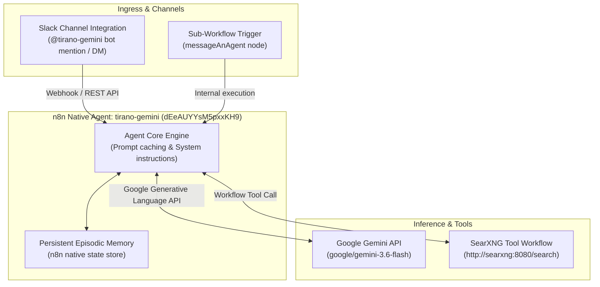

# Native Agent: tirano-gemini

A native n8n Agent introduced in n8n 2.35+ (`N8N_ENABLED_MODULES=agents,instance-ai`). tirano-gemini operates as an autonomous, persistent assistant directly integrated with Slack, backed by Google Gemini API inference (`google/gemini-3.6-flash`) and real-time SearXNG web search.

---

## 1. Overview & Specifications

| Property | Value |
| :--- | :--- |
| **Agent Name** | `tirano-gemini` |
| **Agent ID** | `dEeAUYYsM5pxxKH9` |
| **Project ID** | `zeGW8E3sHgkaR4Sr` |
| **Model** | `google/gemini-3.6-flash` |
| **Model Credential** | `Kc8tChju7TaXdgp2` (Google Gemini(PaLM) Api account) |
| **Primary Channel Integration** | Slack (Bot Credential ID: `VzU1fxGd9Yg0Y3hM`) |
| **Messaging Experience** | `agent` (Threaded native chat experience) |
| **Episodic Memory** | Built-in n8n storage (`memory.storage: "n8n"`) |
| **Attached Tools** | [`Tool-SearXNG-Search`](../../workflows/tool-searxng-search/) (`hk8OViFZWBnveSCF`) |
| **Direct UI Link** | [https://n8n.local-n8n.com/projects/zeGW8E3sHgkaR4Sr/agents/dEeAUYYsM5pxxKH9](https://n8n.local-n8n.com/projects/zeGW8E3sHgkaR4Sr/agents/dEeAUYYsM5pxxKH9) |

---

## 2. Architecture & Capabilities

---

## 3. Operational Directives & Instructions

tirano-gemini inherits Tirano's strict instructions for operation within Slack:
- **Real-Time Mandate**: For queries regarding current events, live facts, people, places, or technical docs, prioritize calling the `Tool-SearXNG-Search` tool.
- **Direct Answers**: Deliver immediate, high-signal responses without conversational meta-language.
- **Strict Slack mrkdwn Formatting**:
  - Links: `<URL|Anchor Text>`
  - Bold: `*bold*` (single asterisk)
  - Code blocks: Triple backticks on separate lines without language tags
  - Tables: Bulleted lists or inline key-value pairs (Slack does not render markdown tables).

---

## 4. Credential & Runtime Troubleshooting Notes

1. **Host Configuration**: In n8n's `googlePalmApi` credential, the runtime adapter maps `credential.host` directly to the underlying `@ai-sdk/google` `baseURL`. Setting `host: "https://generativelanguage.googleapis.com/"` resulted in 404s because requests were dispatched to `/models/:generateContent` instead of `/v1beta/models/:generateContent`. Updating `host` to `https://generativelanguage.googleapis.com/v1beta` fixes the endpoint resolution.
2. **Model Availability**: Legacy model IDs like `gemini-2.5-flash` were deprecated for new completions with 404 responses. The agent is configured with `google/gemini-3.6-flash`, the official default in n8n's LLM provider defaults.
