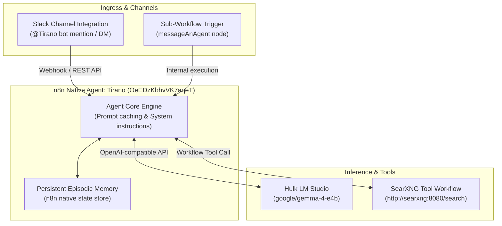

# Native Agent: Tirano

A native n8n Agent introduced in n8n 2.35+ (`N8N_ENABLED_MODULES=agents,instance-ai`). Tirano operates as an autonomous, persistent assistant directly integrated with Slack, backed by local LLM inference on Hulk and real-time SearXNG web search.

---

## 1. Overview & Specifications

| Property | Value |
| :--- | :--- |
| **Agent Name** | `Tirano` |
| **Agent ID** | `OeEDzKbhvVK7aqeT` |
| **Project ID** | `zeGW8E3sHgkaR4Sr` |
| **Model** | `openai/google/gemma-4-e4b` (LM Studio via Hulk @ `100.64.153.30:1234/v1`) |
| **Model Credential** | `hvK9eAePdrKHSgMD` (OpenAI Account on Hulk) |
| **Primary Channel Integration** | Slack (Bot Credential ID: `VzU1fxGd9Yg0Y3hM`) |
| **Messaging Experience** | `agent` (Threaded native chat experience) |
| **Episodic Memory** | Built-in n8n storage (`memory.storage: "n8n"`) |
| **Attached Tools** | [`Tool-SearXNG-Search`](../../workflows/tool-searxng-search/) (`hk8OViFZWBnveSCF`) |
| **Direct UI Link** | [https://n8n.local-n8n.com/projects/zeGW8E3sHgkaR4Sr/agents/OeEDzKbhvVK7aqeT](https://n8n.local-n8n.com/projects/zeGW8E3sHgkaR4Sr/agents/OeEDzKbhvVK7aqeT) |

---

## 2. Architecture & Capabilities

---

## 3. Operational Directives & Instructions

Tirano is configured with strict instructions for operation within Slack:
- **Real-Time Mandate**: For queries regarding current events, live facts, people, places, or technical docs, prioritize calling the `Tool-SearXNG-Search` tool.
- **Direct Answers**: Deliver immediate, high-signal responses without conversational meta-language.
- **Strict Slack mrkdwn Formatting**:
  - Links: `<URL|Anchor Text>`
  - Bold: `*bold*` (single asterisk)
  - Code blocks: Triple backticks on separate lines without language tags
  - Tables: Bulleted lists or inline key-value pairs (Slack does not render markdown tables).
