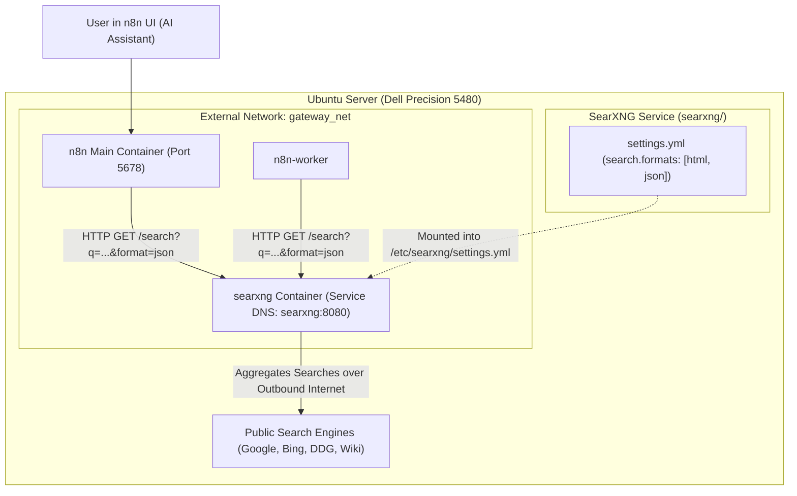

# Implementation Plan: Deploying Self-Hosted SearXNG for n8n AI Assistant

Plan and operational architecture to deploy a self-hosted **SearXNG** instance alongside `Local-N8n`. This enables n8n's AI Assistant and AI Agents to perform real-time web searches and access external documentation and APIs without relying on third-party paid search services or sending search telemetry to external platforms.

---

## User Review Required

> [!IMPORTANT]
> **JSON Search API Requirement**: By default, SearXNG only serves HTML responses. To function as an AI Assistant search backend, `settings.yml` must explicitly enable JSON formatting (`search.formats: [html, json]`) and disable internal rate-limiting (`server.limiter: false`) for internal Docker communication.

> [!NOTE]
> **Zero API Costs & Total Privacy**: Running SearXNG locally routes search queries across multiple public search backends (Google, Bing, DuckDuckGo, Wikipedia, GitHub) through the host server without tracking, cookies, or requiring external API subscriptions (unlike Brave Search).

---

## Proposed Architecture & Network Topology



---

## Proposed Repository Changes

### 1. [Component: SearXNG Stack (`searxng/`)]

#### [NEW] [searxng/docker-compose.yaml](file:///Users/victor/Dev/Local-N8n/searxng/docker-compose.yaml)
Create a standalone Compose stack for SearXNG:
- **Image**: `searxng/searxng:latest`
- **Container Name**: `local-n8n-searxng`
- **Restart Policy**: `unless-stopped`
- **Networks**: Attached to `gateway_net` (service alias `searxng`)
- **Port Bindings**: Zero-Trust host exposure `127.0.0.1:8088:8080` & `100.116.224.88:8088:8080` (avoids port collisions)
- **Environment**:
  - `SEARXNG_SECRET=${SEARXNG_SECRET_KEY}` (injected via Doppler `silver-worker/prd`)
  - `SEARXNG_BASE_URL=http://searxng:8080/`
- **Volumes**:
  - `./settings.yml:/etc/searxng/settings.yml:ro`

#### [NEW] [searxng/settings.yml](file:///Users/victor/Dev/Local-N8n/searxng/settings.yml)
Configuration file pre-configured for n8n AI Assistant:
```yaml
use_default_settings: true
server:
  port: 8080
  bind_address: "0.0.0.0"
  secret_key: "ultrasecretkey"
  limiter: false
  image_proxy: false
search:
  safe_search: 0
  autocomplete: ""
  formats:
    - html
    - json
```

#### [NEW] [searxng/README.md](file:///Users/victor/Dev/Local-N8n/searxng/README.md)
Documentation and test commands for the SearXNG search engine.

---

### 2. [Component: Host Boot Persistence (`systemd`)]

#### [NEW] `/etc/systemd/system/local-n8n-searxng.service`
Host-level systemd unit to guarantee automatic startup and secret injection on host reboot:

```ini
[Unit]
Description=Local n8n SearXNG Search Service with Doppler Secrets
Requires=docker.service local-n8n.service
After=docker.service network-online.target local-n8n.service

[Service]
Type=oneshot
RemainAfterExit=yes
WorkingDirectory=/home/silver-worker/Local-N8n/searxng
User=silver-worker
Group=docker

ExecStartPre=/usr/bin/docker compose down
ExecStart=/usr/bin/doppler run -- /usr/bin/docker compose up -d
ExecStop=/usr/bin/docker compose down
TimeoutStopSec=60

[Install]
WantedBy=multi-user.target
```

---

### 3. [Component: Documentation & Manifest Synchronization]

- [x] **[`.env-sample`](file:///Users/victor/Dev/Local-N8n/.env-sample)**: Add `SEARXNG_SECRET_KEY` schema reference.
- [x] **[`planning/repo-map/ARCHITECTURE.md`](file:///Users/victor/Dev/Local-N8n/planning/repo-map/ARCHITECTURE.md)**: Document `searxng` service topology and `gateway_net` DNS routing.
- [x] **[`planning/repo-map/ENVIRONMENT_AND_SECRETS.md`](file:///Users/victor/Dev/Local-N8n/planning/repo-map/ENVIRONMENT_AND_SECRETS.md)**: Add `SEARXNG_SECRET_KEY` to secrets dictionary.
- [x] **[`planning/repo-map/OPERATIONS_AND_DEPLOYMENT.md`](file:///Users/victor/Dev/Local-N8n/planning/repo-map/OPERATIONS_AND_DEPLOYMENT.md)**: Include SearXNG lifecycle commands.
- [x] **[`planning/repo-map/FILE_MANIFEST.md`](file:///Users/victor/Dev/Local-N8n/planning/repo-map/FILE_MANIFEST.md)**: Update file index with `searxng/` directory.

---

## Step-by-Step Implementation & Verification Plan

### Step 1: Provision `SEARXNG_SECRET_KEY` in Doppler
```bash
# Generate high-entropy secret key and store in Doppler
SEARX_SECRET=$(openssl rand -hex 32)
doppler secrets set SEARXNG_SECRET_KEY="$SEARX_SECRET" --project silver-worker --config prd
```

### Step 2: Scaffold Repository Files & Sync to Server
Create `searxng/docker-compose.yaml` and `searxng/settings.yml` locally, then push/sync to `/home/silver-worker/Local-N8n/searxng/` via SSH.

### Step 3: Deploy & Verify
```bash
# Deploy with Doppler runtime secrets
cd /home/silver-worker/Local-N8n/searxng
doppler run -- docker compose up -d

# Verify JSON search response from inside n8n container
docker exec local-n8n-n8n-1 wget -q -O - "http://searxng:8080/search?q=n8n&format=json"
```

### Step 4: Configure n8n UI
In the **"Add web search"** modal:
1. **Option**: Select `SearXNG (Free · Recommended)`.
2. **Instance URL**: Enter **`http://searxng:8080`**.
3. Click **Save**.
