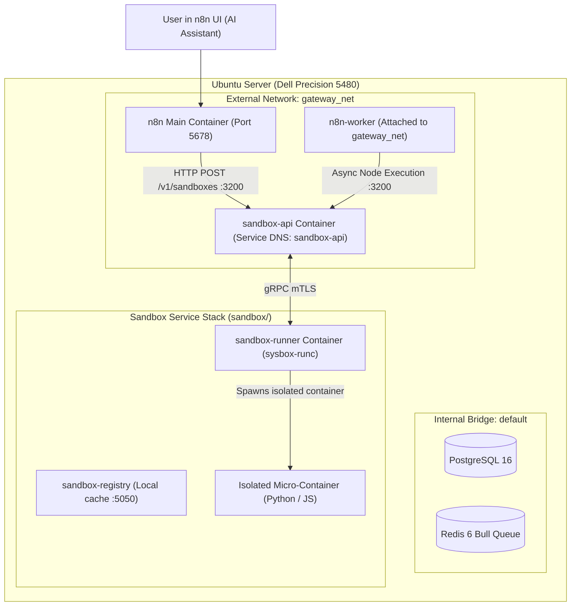

# Implementation Plan: Deploying Self-Hosted n8n Code Sandbox

Plan and operational guide to deploy the official self-hosted **n8n Sandbox Service** (`n8n-sandbox-service`) alongside the existing `Local-N8n` stack. This enables n8n's AI Assistant and AI Agents to securely execute generated JavaScript and Python code inside isolated Docker-in-Docker sandbox micro-containers on your Ubuntu server.

---

## User Review Required

> [!IMPORTANT]
> **Host Dependency Requirement**: The official production Linux runner for `n8n-sandbox-service` utilizes **`sysbox-runc`** (an unprivileged Docker runtime) to safely spawn micro-containers inside runner containers without requiring insecure root `--privileged` flags. The automated setup script provided by n8n installs `sysbox v0.7.0` on the Ubuntu host.

> [!NOTE]
> **Zero-Trust Network Isolation & Privacy**: Running the local sandbox ensures that code snippets, prompts, and temporary files never leave your private Ubuntu server / Meshnet environment. All container endpoints are attached to `gateway_net` and bound strictly to loopback or Meshnet interfaces.

---

## Proposed Architecture & Network Topology



---

## Proposed Codebase & Configuration Changes

### 1. [Component: Main Stack (`compose.yaml`)]

#### [MODIFY] [compose.yaml](file:///Users/victor/Dev/Local-N8n/compose.yaml)
- **Worker Queue Connectivity**: Attach `n8n-worker` service to `gateway_net` (alongside `default`) so background execution nodes in Queue Mode can resolve and route requests to `http://sandbox-api:3200`.

```yaml
  # n8n Worker for Queue Execution
  n8n-worker:
    <<: *shared
    command: worker
    depends_on:
      - n8n
    networks:
      - default
      - gateway_net
```

---

### 2. [Component: Sandbox Service Stack (`sandbox/`)]

#### [NEW] [sandbox/docker-compose.yaml](file:///Users/victor/Dev/Local-N8n/sandbox/docker-compose.yaml)
Create a dedicated Compose file for the sandbox service:
- **`sandbox-api`**:
  - Image: `docker.n8n.io/n8nio/runners-api` (or n8n sandbox API image).
  - Listens internally on port `3200`.
  - Networks: Attached to `gateway_net` (with alias `sandbox-api`) and internal `sandbox_net`.
  - Zero-Trust Port Binding: If exposed to the host for diagnostics, bound strictly to `127.0.0.1:3200:3200` or `100.116.224.88:3200:3200` (never `0.0.0.0:3200`).
  - Environment: `SANDBOX_API_KEYS=${SANDBOX_API_KEY}` injected via Doppler.
- **`sandbox-runner`**:
  - Runtime: `sysbox-runc`.
  - Connected via gRPC with mTLS certificates to `sandbox-api`.
- **`sandbox-registry`**:
  - Local caching registry on `5050` to deliver sandbox execution images.

---

### 3. [Component: Host Boot Persistence (`systemd`)]

#### [NEW] `/etc/systemd/system/local-n8n-sandbox.service`
Create a dedicated host-level systemd unit to guarantee automatic startup and secret injection on host reboot:

```ini
[Unit]
Description=Local n8n Sandbox Service with Doppler Secrets
Requires=docker.service local-n8n.service
After=docker.service network-online.target local-n8n.service

[Service]
Type=oneshot
RemainAfterExit=yes
WorkingDirectory=/home/silver-worker/Local-N8n/sandbox
User=silver-worker
Group=docker

# Clean up stale containers before starting
ExecStartPre=/usr/bin/docker compose down
# Inject secrets from Doppler directly into Docker Compose at boot
ExecStart=/usr/bin/doppler run -- /usr/bin/docker compose up -d
# Graceful shutdown on host stop/reboot
ExecStop=/usr/bin/docker compose down
TimeoutStopSec=60

[Install]
WantedBy=multi-user.target
```

---

### 4. [Component: Documentation & Secrets Schema Sync]

- [x] **[`.env-sample`](file:///Users/victor/Dev/Local-N8n/.env-sample)**: Add `SANDBOX_API_KEY` and `SANDBOX_API_PORT` schema definitions.
- [x] **[`planning/repo-map/ARCHITECTURE.md`](file:///Users/victor/Dev/Local-N8n/planning/repo-map/ARCHITECTURE.md)**: Document `sandbox-api` service, `gateway_net` routing, and `sysbox-runc` isolation topology.
- [x] **[`planning/repo-map/ENVIRONMENT_AND_SECRETS.md`](file:///Users/victor/Dev/Local-N8n/planning/repo-map/ENVIRONMENT_AND_SECRETS.md)**: Document `SANDBOX_API_KEY` secret lifecycle and Doppler scoping.
- [x] **[`planning/repo-map/OPERATIONS_AND_DEPLOYMENT.md`](file:///Users/victor/Dev/Local-N8n/planning/repo-map/OPERATIONS_AND_DEPLOYMENT.md)**: Include `local-n8n-sandbox.service` management and sysbox diagnostics.
- [x] **[`planning/repo-map/FILE_MANIFEST.md`](file:///Users/victor/Dev/Local-N8n/planning/repo-map/FILE_MANIFEST.md)**: Update inventory with `sandbox/docker-compose.yaml` and `local-n8n-sandbox.service`.
- [x] **[`planning/repo-map/README.md`](file:///Users/victor/Dev/Local-N8n/planning/repo-map/README.md)**: Update directory tree and agent quick references.

---

## Step-by-Step Manual Actions Required on the Server

### Step 1: Install `sysbox-runc` on the Ubuntu Host
On your Ubuntu server (`silver-worker` on Dell Precision 5480):

```bash
# 1. Download official sysbox installation script
curl -fsSL -o setup-sysbox.sh https://raw.githubusercontent.com/n8n-io/n8n-sandbox-service/refs/heads/main/scripts/setup-sysbox.sh
chmod +x setup-sysbox.sh

# 2. Run installation (requires sudo)
sudo ./setup-sysbox.sh

# 3. Verify sysbox runtime is registered in Docker
docker info --format '{{json .Runtimes}}' | grep sysbox-runc
```

---

### Step 2: Generate & Inject Sandbox API Key into Doppler
Generate a random secret and store it in your Doppler `silver-worker/prd` configuration:

```bash
# 1. Generate high-entropy API key
SANDBOX_SECRET=$(openssl rand -hex 24)
echo "Your generated key: $SANDBOX_SECRET"

# 2. Store in Doppler
doppler secrets set SANDBOX_API_KEY="$SANDBOX_SECRET" --project silver-worker --config prd
```

---

### Step 3: Deploy Sandbox Stack & Enable Boot Persistence
Launch the sandbox service and register its systemd unit on the host:

```bash
# 1. Start sandbox stack with Doppler
cd /home/silver-worker/Local-N8n/sandbox
doppler run -- docker compose up -d

# 2. Enable systemd service for host reboot persistence
sudo systemctl daemon-reload
sudo systemctl enable local-n8n-sandbox.service
sudo systemctl start local-n8n-sandbox.service
sudo systemctl status local-n8n-sandbox.service
```

---

### Step 4: Complete UI Modal Setup in n8n
Return to the **"Add a code sandbox"** modal in your n8n browser interface:

1. **Option**: Select `n8n Sandbox (Free · Recommended)`.
2. **Service URL**:
   - `http://sandbox-api:3200` *(Internal DNS resolvable by both `n8n` and `n8n-worker` over `gateway_net`)*.
3. **API key**:
   - Paste the `$SANDBOX_SECRET` generated in Step 2.
4. Click **Continue**.

---

## Verification Plan

### Automated Checks
1. Validate sandbox API health endpoint over `gateway_net`:
   ```bash
   # From host (if bound to 127.0.0.1 or Meshnet IP)
   curl -s -H "Authorization: Bearer $SANDBOX_SECRET" http://127.0.0.1:3200/health
   
   # Or from within n8n container
   docker compose exec n8n curl -s -H "Authorization: Bearer $SANDBOX_SECRET" http://sandbox-api:3200/health
   ```

2. Test code execution endpoint:
   ```bash
   curl -s -X POST http://127.0.0.1:3200/v1/sandboxes \
     -H "Authorization: Bearer $SANDBOX_SECRET" \
     -H "Content-Type: application/json" \
     -d '{"language": "javascript", "code": "console.log(1 + 1)"}'
   ```

### Manual Verification
1. Open the n8n AI Assistant canvas.
2. Prompt the Assistant: *"Write a Python script that calculates Fibonacci numbers up to 10 and execute it in the sandbox."*
3. Confirm the code executes cleanly inside the `sysbox-runc` micro-container and returns the expected result.
