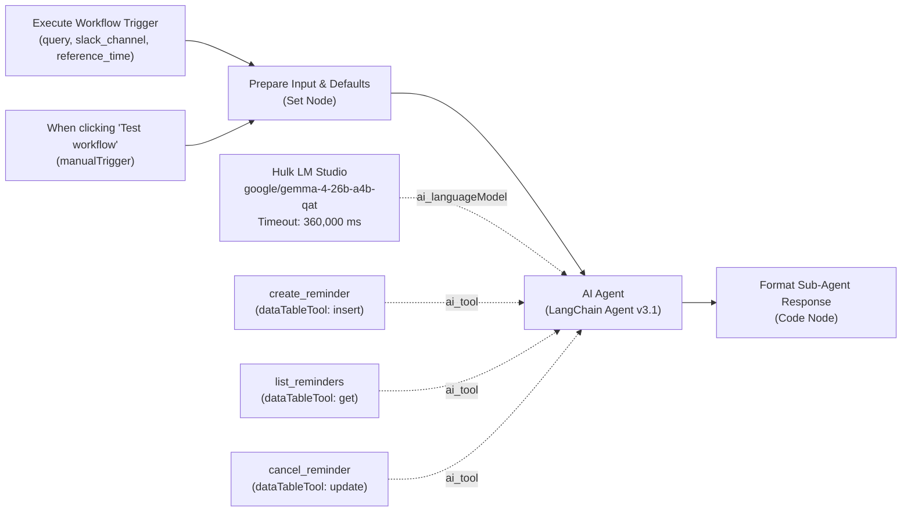

# Implementation Plan: Phase 1 & 2 of Private Task & Calendar Sub-Agent for Tirano

This plan outlines the architecture and step-by-step implementation for **Phase 1** (Local Storage Schema Setup) and **Phase 2** (Sub-Agent Workflow Engineering) as specified in [`planning/calendar-agent/roadmap-calendar.md`](file:///Users/victor/Dev/Local-N8n/planning/calendar-agent/roadmap-calendar.md).

All reminder, task, and calendar data remains strictly local in **n8n Data Tables** with zero external cloud dependencies. The sub-agent will resolve dynamic relative dates against current host time (`$now`), calculate multi-tiered alert offsets, persist records to the `reminders` table, and return structured scheduling responses.

---

## User Review Required

> [!IMPORTANT]
> **LLM Model Name Confirmation**:
> The roadmap specifies `google/gemma-4-26b-a4b-qat` on Hulk (`http://100.64.153.30:1234/v1`).
> In existing workflows (`workflows/ai-testing/` and `agents/tirano/agent.json`), the model is set to `google/gemma-4-e4b`.
> We will configure `google/gemma-4-26b-a4b-qat` with timeout `360000` ms (6 minutes) on the OpenAI credential `hvK9eAePdrKHSgMD`. If the 26B model is not currently loaded in LM Studio, the 6-minute timeout will give LM Studio ample time to swap/load weights into VRAM.

> [!NOTE]
> **Built-in Data Table Primary Key**:
> n8n Data Tables manage row `id` automatically as an internal system field. We will define the 6 custom application columns: `task`, `target_time`, `notify_time`, `offset_label`, `status`, and `slack_channel`.

---

## Proposed Changes & Architectural Blueprint

### Phase 1: Local Storage Schema Setup (`reminders` Data Table)

We will use the n8n MCP tool `n8n_manage_datatable` (`action: "createTable"`) to provision the `reminders` table in project `zeGW8E3sHgkaR4Sr` with the following column schema:

| Column Name | Data Type | Purpose & Constraints |
| :--- | :--- | :--- |
| `task` | `string` | Description of event/task (e.g. `"Feed the dogs"`, `"Call Joseph"`) |
| `target_time` | `date` | Absolute ISO 8601 timestamp of actual event |
| `notify_time` | `date` | Exact ISO 8601 timestamp when alert must be triggered |
| `offset_label` | `string` | Timing tag (e.g. `"10 minutes before"`, `"1 week before"`, `"event time"`) |
| `status` | `string` | Delivery state: `"pending"`, `"completed"`, `"cancelled"` |
| `slack_channel` | `string` | Target Slack channel ID or user DM ID |

**Verification & Validation**:
- Execute a test row insertion (`insertRows`) into `reminders`.
- Query the row (`getRows`) to verify schema and round-trip data persistence.
- Delete the test row (`deleteRows`) to leave a clean storage state.

---

### Phase 2: Calendar & Task Sub-Agent Workflow (`sub-agent-calendar-manager`)

We will scaffold and deploy the autonomous sub-agent workflow using `n8n_create_workflow` (with safe staging `active: false`), followed by testing and validation.

#### Workflow Topology & Canvas Design



#### Node Specifications:

1. **`When Executed by Another Workflow` (`n8n-nodes-base.executeWorkflowTrigger` v1.1)**:
   - Configured workflow inputs: `query` (String), `slack_channel` (String), `reference_time` (String).

2. **`When clicking 'Test workflow'` (`n8n-nodes-base.manualTrigger` v1)**:
   - Enables direct interactive canvas test runs and debugging.

3. **`Prepare Sub-Agent Input` (`n8n-nodes-base.set` v3.4)**:
   - Sets safe defaults for manual testing:
     - `query`: `={{ $json.query || "Remind me to feed the dogs in 10 minutes" }}`
     - `slack_channel`: `={{ $json.slack_channel || "C_TEST_ALERTS" }}`
     - `reference_time`: `={{ $json.reference_time || $now.toISO() }}`

4. **`Calendar Sub-Agent` (`@n8n/n8n-nodes-langchain.agent` v3.1)**:
   - `promptType`: `"define"`
   - `text`: `={{ $json.query }}`
   - `options.systemMessage`:
     - Injects reference time: `Current host reference time is: {{ $json.reference_time }}`.
     - Injects channel context: `Target Slack channel: {{ $json.slack_channel }}`.
     - Multi-tier alert generation rules:
       - Multi-tier requests (e.g. "On Jan 5 2028 remind me to call Joseph, remind me 1 week and 1 day before") MUST trigger multiple discrete `create_reminder` calls:
         1. Offset 1: `notify_time` 1 week before (`2027-12-29T...`), `offset_label`: `"1 week before"`
         2. Offset 2: `notify_time` 1 day before (`2028-01-04T...`), `offset_label`: `"1 day before"`
         3. Event time: `notify_time` at event time (`2028-01-05T...`), `offset_label`: `"event time"`
       - Relative times (e.g. "in 10 minutes") calculate `notify_time` as `reference_time + 10m`.
       - Event queries (e.g. "What do I have scheduled for tomorrow?") trigger `list_reminders`.
       - Cancellations trigger `cancel_reminder` setting status to `"cancelled"`.

5. **`Hulk LM Studio Model` (`@n8n/n8n-nodes-langchain.lmChatOpenAi` v1.3)**:
   - Credential: `hvK9eAePdrKHSgMD` (OpenAI Account on Hulk)
   - Model: `google/gemma-4-26b-a4b-qat`
   - Options: `temperature: 0.1`, `timeout: 360000`, `maxRetries: 2`
   - `responsesApiEnabled: false`

6. **Data Table Tools**:
   - `create_reminder` (`n8n-nodes-base.dataTableTool` v1.1):
     - `resource`: `"row"`, `operation`: `"insert"`
     - `dataTableId`: `reminders` table ID
     - `toolDescription`: `"Insert a new reminder into the reminders table. Requires: task, target_time, notify_time, offset_label, status='pending', slack_channel."`
   - `list_reminders` (`n8n-nodes-base.dataTableTool` v1.1):
     - `resource`: `"row"`, `operation`: `"get"`
     - `dataTableId`: `reminders` table ID
     - `returnAll`: `true`
     - `toolDescription`: `"List existing reminders from the reminders table. Returns task, target_time, notify_time, offset_label, status, and slack_channel."`
   - `cancel_reminder` (`n8n-nodes-base.dataTableTool` v1.1):
     - `resource`: `"row"`, `operation`: `"update"`
     - `dataTableId`: `reminders` table ID
     - `toolDescription`: `"Cancel a reminder by updating its status to 'cancelled'."`

7. **`Format Sub-Agent Response` (`n8n-nodes-base.code` v2)**:
   - Formats clean JSON output for the orchestrator:
     ```json
     {
       "status": "success",
       "query": "<user_query>",
       "response": "<agent_summary>",
       "timestamp": "<iso_string>"
     }
     ```

---

### Local Repository Artifacts to Create / Update

#### [NEW] [`workflows/sub-agent-calendar-manager/workflow.json`](file:///Users/victor/Dev/Local-N8n/workflows/sub-agent-calendar-manager/workflow.json)
Exported canonical JSON definition of the sub-agent workflow.

#### [NEW] [`workflows/sub-agent-calendar-manager/README.md`](file:///Users/victor/Dev/Local-N8n/workflows/sub-agent-calendar-manager/README.md)
Documentation covering inputs, outputs, tool wiring, system prompt, and execution test cases.

#### [MODIFY] [`workflows/README.md`](file:///Users/victor/Dev/Local-N8n/workflows/README.md)
Add the `sub-agent-calendar-manager` entry to the index of exported workflows.

#### [MODIFY] [`planning/calendar-agent/roadmap-calendar.md`](file:///Users/victor/Dev/Local-N8n/planning/calendar-agent/roadmap-calendar.md)
Update status indicators for Phase 1 and Phase 2 from `Ready` to `Complete`.

---

## Verification Plan

### Phase 1 Verification:
1. Call `n8n_manage_datatable` (`action: "listTables"`) to verify `reminders` exists.
2. Call `n8n_manage_datatable` (`action: "insertRows"`) with a sample row:
   ```json
   {
     "task": "Test verification task",
     "target_time": "2026-09-04T12:00:00.000Z",
     "notify_time": "2026-09-04T11:50:00.000Z",
     "offset_label": "10 minutes before",
     "status": "pending",
     "slack_channel": "C_TEST"
   }
   ```
3. Call `n8n_manage_datatable` (`action: "getRows"`) to verify the row was saved.
4. Call `n8n_manage_datatable` (`action: "deleteRows"`) to remove the test row.

### Phase 2 Verification (Automated MCP Tests):
1. Pre-flight schema validation: run `validate_workflow` on the generated workflow JSON before creation.
2. Create workflow via `n8n_create_workflow` with `active: false`.
3. **TC-01 (Relative Offset Test)**:
   - Run workflow test execution with payload:
     `{ "query": "Remind me to feed the dogs in 10 minutes", "slack_channel": "C_VERIFY" }`
   - Verify execution succeeds and inspect `reminders` table via `getRows` to confirm a row was created with `notify_time` ~10 minutes ahead and `offset_label` `"10 minutes before"` or `"event time"`.
4. **TC-02 (Multi-Tiered Offset Test)**:
   - Run workflow test execution with payload:
     `{ "query": "On Jan 5 2028 remind me to call Joseph, remind me 1 week and 1 day before", "slack_channel": "C_VERIFY" }`
   - Verify `reminders` table contains 3 discrete rows:
     - 2027-12-29 (`"1 week before"`)
     - 2028-01-04 (`"1 day before"`)
     - 2028-01-05 (`"event time"`)
5. Clean up test rows in `reminders` table.
