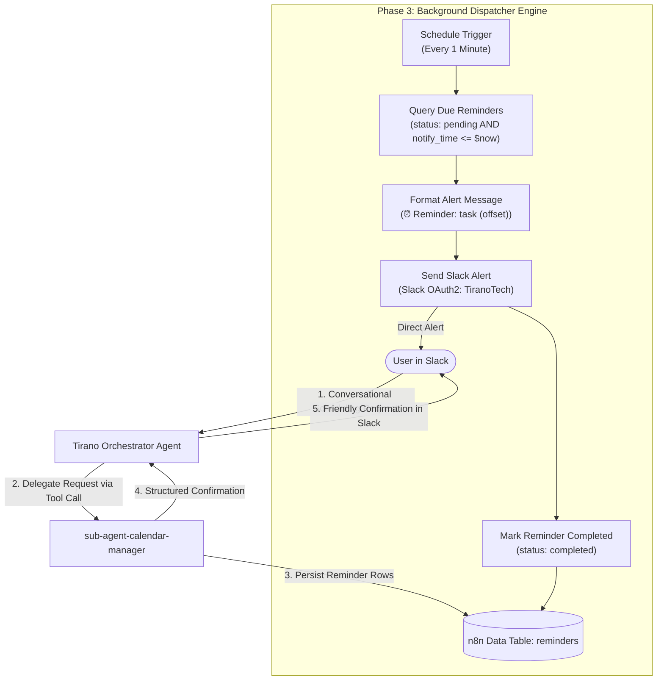

# Implementation Plan: Phase 3 & Phase 4 — Private Task & Calendar Sub-Agent for Tirano

This plan outlines the architecture, implementation steps, and validation strategy for **Phase 3** (Automated Reminder Poller background dispatcher) and **Phase 4** (Tirano Orchestrator Integration) as defined in [`planning/calendar-agent/roadmap-calendar.md`](file:///Users/victor/Dev/Local-N8n/planning/calendar-agent/roadmap-calendar.md).

---

## Architecture & Communication Flow



---

## User Review Required

> [!IMPORTANT]
> **Slack Target Channel for Notifications**:
> The `reminder-poller` dispatches notifications to each row's `slack_channel`. If a reminder record has a fallback or missing channel, it defaults to `#all-tiranotech` (or the primary channel configured on `slackOAuth2Api` `aSF0sVdzDzhmMBK3`).

> [!NOTE]
> **Tirano Standalone Native Agent Update (Phase 4)**:
> Native n8n Agents (n8n 2.35+) are edited in the n8n UI under the **Agents** tab ([Direct UI Link](https://n8n.local-n8n.com/projects/zeGW8E3sHgkaR4Sr/agents/OeEDzKbhvVK7aqeT)). We will update the canonical Git schema in [`agents/tirano/agent.json`](file:///Users/victor/Dev/Local-N8n/agents/tirano/agent.json) and [`agents/tirano/README.md`](file:///Users/victor/Dev/Local-N8n/agents/tirano/README.md) to register `sub-agent-calendar-manager` (Workflow ID `SJqxOcqXZ4WALQDz`) as an attached Workflow Tool, update the model to `gemma-4-26b-a4b-qat`, and provide the exact routing instructions for Tirano.

---

## Proposed Changes

### Phase 3: Automated Reminder Poller (`reminder-poller`)

We will scaffold and deploy the background poller workflow using `n8n_create_workflow` and activate it:

#### Node Specifications:
1. **`Schedule Trigger` (`n8n-nodes-base.scheduleTrigger` v1.4)**:
   - Interval: Every 1 minute (`field: "minutes", minutesInterval: 1`).
2. **`When clicking "Test workflow"` (`n8n-nodes-base.manualTrigger` v1)**:
   - Enables on-demand canvas test runs.
3. **`Query Due Reminders` (`n8n-nodes-base.dataTable` v1.1)**:
   - `resource`: `"row"`, `operation`: `"get"`, `returnAll`: `true`
   - `dataTableId`: `SYBlBNK8FaTVTDdc` (`reminders` table)
   - `matchType`: `"allConditions"`
   - `filters`:
     - `status` equals `"pending"`
     - `notify_time` <= `{{ $now.toISO() }}`
4. **`Format Alert Message` (`n8n-nodes-base.code` v2)**:
   - Extracts task and offset label, sanitizing channel target:
     - `alert_text`: `⏰ *Reminder:* ${row.task} (${row.offset_label})`
     - `alert_channel`: `row.slack_channel` (falls back to `all-tiranotech`)
     - `row_id`: `row.id`
5. **`Send Slack Alert` (`n8n-nodes-base.slack` v2.2)**:
   - `authentication`: `"oAuth2"`
   - `credentials`: `slackOAuth2Api` (`aSF0sVdzDzhmMBK3`, "TiranoTech")
   - `channelId`: `={{ $json.alert_channel }}`
   - `text`: `={{ $json.alert_text }}`
   - `onError`: `"continueRegularOutput"`
6. **`Mark Reminder Completed` (`n8n-nodes-base.dataTable` v1.1)**:
   - `resource`: `"row"`, `operation`: `"update"`
   - `dataTableId`: `SYBlBNK8FaTVTDdc`
   - `filters`: `id` equals `={{ $('Format Alert Message').item.json.row_id }}`
   - `columns`: sets `status` to `"completed"`.

---

### Phase 4: Tirano Orchestrator Integration

1. **Update [`agents/tirano/agent.json`](file:///Users/victor/Dev/Local-N8n/agents/tirano/agent.json)**:
   - Update model property to `openai/gemma-4-26b-a4b-qat`.
   - Add `sub-agent-calendar-manager` to `schema.tools`:
     ```json
     {
       "name": "sub-agent-calendar-manager",
       "type": "workflow",
       "workflow": "sub-agent-calendar-manager",
       "workflowId": "SJqxOcqXZ4WALQDz",
       "description": "Use this tool to schedule reminders and appointments, inspect upcoming tasks/reminders, or cancel reminders. Pass query and slack_channel.",
       "allOutputs": false
     }
     ```
   - Update system instructions to include delegation rules:
     ```text
     You have access to a specialized Calendar & Task Sub-Agent (sub-agent-calendar-manager).
     When the user asks to schedule a reminder, set an appointment, check upcoming events, or cancel a reminder:
     1. Delegate the request to the sub-agent-calendar-manager tool.
     2. Pass the user's explicit query along with the current Slack channel/user ID.
     3. Do not invent or assume scheduling confirmations without receiving confirmation from the sub-agent.
     ```
2. **Update [`agents/tirano/README.md`](file:///Users/victor/Dev/Local-N8n/agents/tirano/README.md)**:
   - Document the attached sub-agent tool and updated model `gemma-4-26b-a4b-qat`.
3. **Repository Workflow Exports**:
   - [NEW] [`workflows/reminder-poller/workflow.json`](file:///Users/victor/Dev/Local-N8n/workflows/reminder-poller/workflow.json)
   - [NEW] [`workflows/reminder-poller/README.md`](file:///Users/victor/Dev/Local-N8n/workflows/reminder-poller/README.md)
   - [MODIFY] [`workflows/README.md`](file:///Users/victor/Dev/Local-N8n/workflows/README.md)
   - [MODIFY] [`planning/calendar-agent/roadmap-calendar.md`](file:///Users/victor/Dev/Local-N8n/planning/calendar-agent/roadmap-calendar.md)

---

## Verification Plan

### Phase 3 Verification:
1. Pre-flight schema validation: `validate_workflow` on `reminder-poller` workflow JSON.
2. Deploy `reminder-poller` via `n8n_create_workflow` (workflow ID: `reminder-poller`).
3. **Matured Alert Trigger Test**:
   - Insert a test row into `reminders` table with `notify_time` set to 1 minute in the past (`{{ $now.minus({ minutes: 1 }).toISO() }}`), `status: "pending"`, and `slack_channel: "all-tiranotech"`.
   - Trigger `reminder-poller` manually via MCP or allow the 1-minute schedule to trigger.
   - Verify that:
     1. The reminder row status changes to `"completed"`.
     2. The message `⏰ *Reminder:* Test Task (1 minute before)` is posted to Slack.
4. Verify idempotency: run `reminder-poller` again; confirm 0 duplicate messages sent since status is now `"completed"`.

### Phase 4 Verification:
1. Verify `sub-agent-calendar-manager` tool definition in `agent.json`.
2. Test end-to-end delegation through the bridge workflow (`slack-ai-agent`, ID `Fq6gdZ5X10eOiCQA`), simulating a Slack mention requesting: `"Remind me to review server metrics in 10 minutes"`.
3. Confirm Tirano responds with the sub-agent's confirmation.
