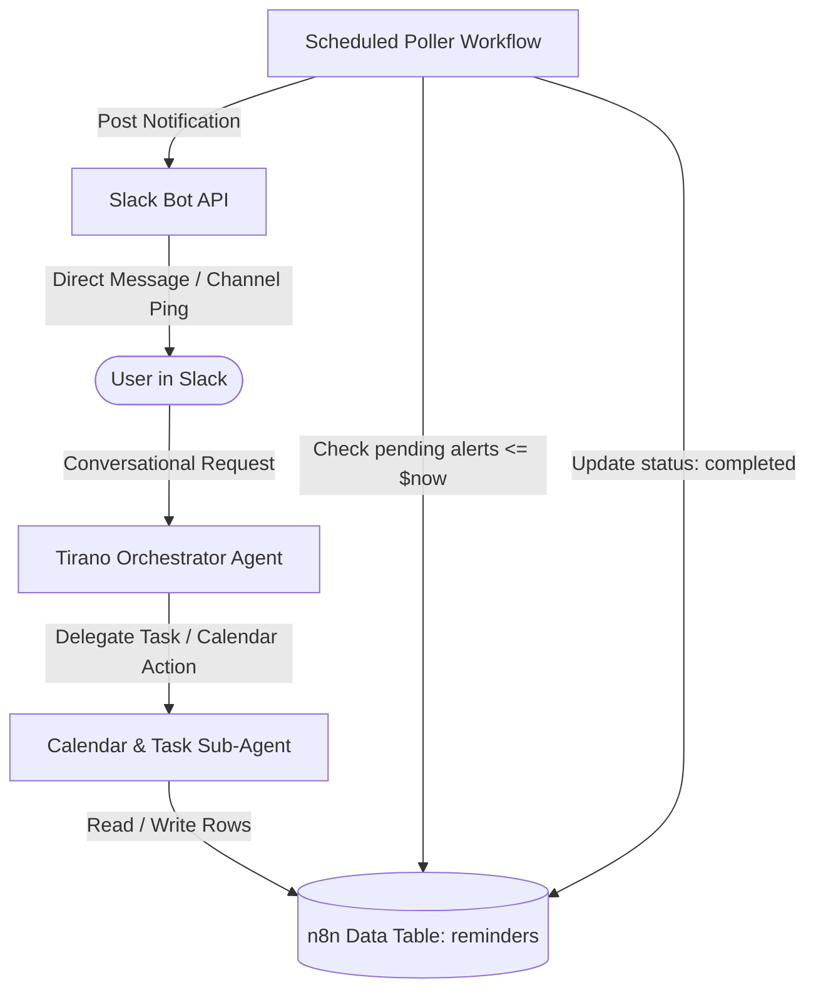

```markdown
# Implementation Roadmap: Private Task & Calendar Sub-Agent for Tirano

> **Objective**: Implement a self-hosted, private task and calendar management sub-agent integrated with the primary **Tirano** Slack agent. All appointment and reminder data remains strictly local in n8n Data Tables with zero external calendar cloud dependencies.

---

## Technical Specifications & Architecture

- **Primary Orchestrator**: `Tirano` (Native n8n Standalone Agent, connected to Slack)
- **Primary Model**: `google/gemma-4-26b-a4b-qat` (hosted on Hulk via LM Studio at `http://100.64.153.30:1234/v1`)
- **Sub-Agent Model**: `google/gemma-4-26b-a4b-qat`
- **Data Store**: n8n Data Tables (`reminders` table)
- **Alert Dispatcher**: Scheduled n8n background polling workflow triggering direct Slack notifications



---

## Phase Overview

| Phase | Milestone | Scope / Highlights | Status |
| --- | --- | --- | --- |
| **Phase 1** | **Local Storage Schema Setup** | Provision `reminders` table in n8n Data Tables with date-indexed fields. | Completed |
| **Phase 2** | **Sub-Agent Workflow Engineering** | Build sub-agent workflow using Gemma 26B to calculate ISO offsets and persist records. | Completed |
| **Phase 3** | **Automated Reminder Poller** | Construct scheduled cron workflow querying due tasks and dispatching Slack messages. | Ready |
| **Phase 4** | **Tirano Orchestrator Integration** | Attach sub-agent tool to native Tirano configuration with routing instructions. | Ready |
| **Phase 5** | **End-to-End Validation & Guardrails** | Run verification suites covering relative offsets, multi-tiered dates, and query lookups. | Ready |

---

## Phase 1: Local Storage Schema Setup (n8n Data Table)

### Objectives

Initialize private, persistent data storage within n8n Data Tables to track appointments, discrete reminder times, delivery states, and communication targets.

### Tasks

1. Navigate to **Data Tables** in the n8n UI.
2. Create a new table named `reminders`.
3. Configure the following column definitions:

| Column Name | Data Type | Description / Constraints |
| --- | --- | --- |
| `id` | Default / Auto | Unique row identifier |
| `task` | String | Description of event/task (e.g., `"Feed the dogs"`, `"Call Joseph"`) |
| `target_time` | Date | Absolute ISO 8601 timestamp of actual event |
| `notify_time` | Date | Exact ISO 8601 timestamp when alert must be triggered |
| `offset_label` | String | Human-readable timing tag (e.g., `"1 week before"`, `"1 day before"`, `"event time"`) |
| `status` | String | Status indicator: `"pending"`, `"completed"`, or `"cancelled"` |
| `slack_channel` | String | Target Slack channel ID or user DM ID |

### Definition of Done

* Table `reminders` exists in n8n.
* Manual test insertion and deletion succeed.

---

## Phase 2: Calendar & Task Sub-Agent Workflow

### Objectives

Build an autonomous sub-agent workflow capable of receiving natural-language scheduling instructions, resolving dynamic relative dates against current host time (`$now`), calculating multi-tiered alert offsets, and persisting rows into the `reminders` Data Table.

### Tasks

1. Create a new workflow: `sub-agent-calendar-manager`.
2. Configure workflow inputs using an **Execute Workflow Trigger**:
* `query` (String): Raw instruction from user.
* `slack_channel` (String): Source Slack channel/user ID.
* `reference_time` (String): Current ISO timestamp passed from caller (default `{{ $now.toISO() }}`).


3. Connect an **AI Agent Node**:
* **Model**: `@n8n/n8n-nodes-langchain.lmChatOpenAi`
* **Base URL**: `http://100.64.153.30:1234/v1`
* **Model Name**: `google/gemma-4-26b-a4b-qat`
* **Timeout**: `360000` ms


* **System Prompt**:
* Explicitly inject current time context: `Reference time is: {{ $now.toISO() }}`.
* Enforce strict parsing rules: Any advance notification (e.g., "1 week and 1 day before") must produce multiple discrete insertions into the data store, each with calculated `notify_time` and descriptive `offset_label`.
* Support event lookup queries (e.g., "What do I have scheduled for tomorrow?").


4. Attach **Data Table Tools**:
* Create tool capabilities for:
* `create_reminder`: Insert row into `reminders` table.
* `list_reminders`: Query pending rows filtered by date ranges.
* `cancel_reminder`: Set status to `"cancelled"`.


5. Format the final output node to return a structured JSON response to the caller summarizing scheduled alerts.

### Definition of Done

* Direct workflow executions with payload `"Remind me to feed the dogs in 10 minutes"` correctly write a single row with `notify_time` 10 minutes ahead.
* Direct workflow executions with `"On Jan 5 2028 remind me to call Joseph, remind me 1 week and 1 day before"` create three separate records with matching offset dates.

---

## Phase 3: Automated Reminder Poller (Background Cron Dispatcher)

### Objectives

Build a dedicated background cron job that periodically checks for pending reminders that have matured and dispatches notifications via Slack.

### Tasks

1. Create a new workflow: `reminder-poller`.
2. Configure a **Schedule Trigger**:
* Set execution interval (e.g., every 1 minute or every 5 minutes).


3. Query Due Reminders:
* Add a **Data Table** node:
* **Resource**: Row
* **Operation**: Get Many
* **Filter**: `status` equals `"pending"` AND `notify_time` <= `{{ $now.toISO() }}`


4. Add **Slack Notification Node**:
* Send message to target channel: `{{ $json.slack_channel }}`
* Format message payload:
```text
⏰ Reminder: {{ $json.task }} ({{ $json.offset_label }})

```


5. Update Processed Records:
* Add a **Data Table** node to mark alerted rows:
* **Operation**: Update
* Set `status` to `"completed"` where row ID equals `{{ $json.id }}`.


### Definition of Done

* A pending row whose `notify_time` is reached triggers a message in Slack within one polling cycle.
* Row status transitions to `"completed"` preventing duplicate alert dispatches.

---

## Phase 4: Tirano Orchestrator Integration

### Objectives

Integrate the Calendar Sub-Agent workflow into the standalone native `Tirano` agent so all conversational scheduling requests in Slack route naturally.

### Tasks

1. Open the standalone **Tirano** agent in the n8n Agents tab.
2. Register `sub-agent-calendar-manager` under **Sub-agents** (or as a Workflow Tool).
3. Update Tirano's system prompt with routing rules:
```text
You have access to a specialized Calendar & Task Sub-Agent.
When the user asks to schedule a reminder, set an appointment, check upcoming events, or cancel a reminder:
1. Delegate the request to the Calendar & Task Sub-Agent.
2. Pass the user's explicit query along with the current Slack channel/user ID.
3. Do not invent or assume scheduling confirmations without receiving confirmation from the sub-agent.

```


4. Verify that conversational responses reflect the sub-agent's structured confirmation.

### Definition of Done

* Sending a reminder request directly in Slack to `@Tirano` results in an affirmative confirmation from Tirano summarizing the scheduled alerts.

---

## Phase 5: End-to-End Validation & Guardrails

### Test Matrix

| Test ID | Input Prompt in Slack | Expected Outcome | Verification |
| --- | --- | --- | --- |
| **TC-01** | *"Remind me to check server logs in 2 minutes"* | Single row created in `reminders` table; Slack alert received in ~2 minutes; row marked completed. | Database query & Slack DM |
| **TC-02** | *"On Jan 5 2028 remind me to call Joseph, remind me 1 week and 1 day before"* | 3 rows created: 2027-12-29, 2028-01-04, 2028-01-05. | Verify `notify_time` & `offset_label` in Data Table |
| **TC-03** | *"What reminders do I have pending?"* | Tirano queries table and lists all pending tasks formatted cleanly. | Slack conversation response |
| **TC-04** | Cold Model Load Handling | Ensure sub-agent invocation tolerates LM Studio model load time (timeout set to 360,000 ms). | Container logs / execution time |

### Guardrails

* **Timezone Alignment**: Ensure n8n container environment has `GENERIC_TIMEZONE=America/Chicago` (or appropriate local timezone) to avoid UTC parsing offsets.
* **Queue Mode Compatibility**: Standalone agent sub-workflows should run directly in main instance execution scope to avoid preview queue limitations.

```

```