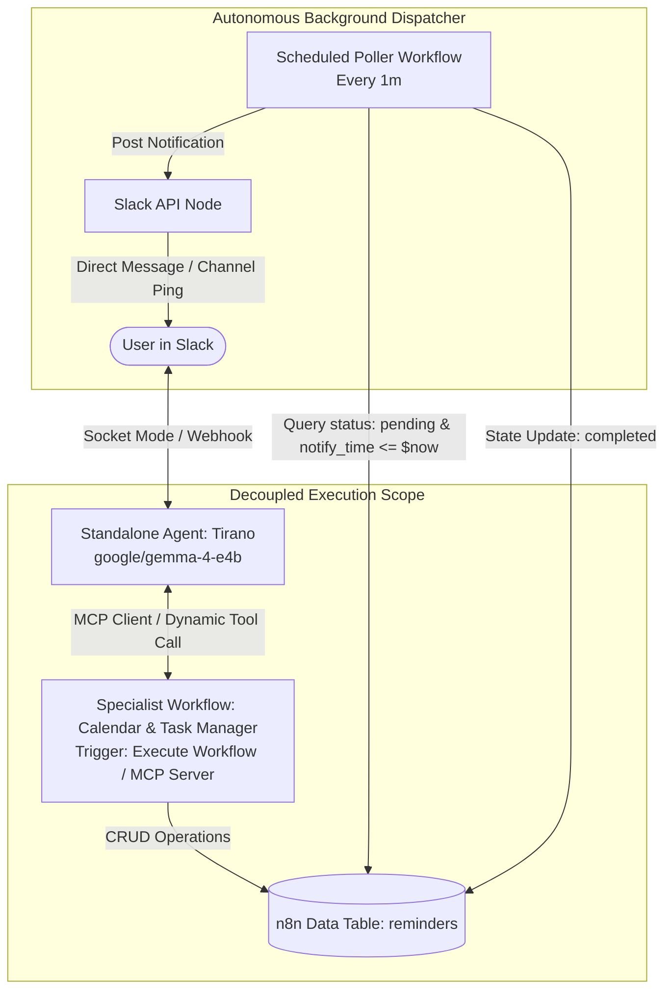

```markdown
# Implementation Roadmap: Standalone Private Calendar & Task Agent System

> **Architecture Directive (Modern n8n Decoupled Agents / v2.35+)**: 
> Do NOT build legacy n8n AI setups (no monolithic single-canvas chains, hardcoded LangChain sub-nodes, or deprecated Workflow Builder templates). Implement using the new standalone agent architecture:
> - **Decoupled Architecture**: Build specialist workflows exposed as standalone modular tools via MCP Server Trigger or dedicated sub-workflow triggers. Never cram logic, memory, and multi-tool dependencies into a single mega-canvas.
> - **Modern MCP Tool Integration**: Connect sub-agents, external model servers, and local tools dynamically using n8n's native MCP Client / Tool connectors rather than wiring rigid, inline sub-nodes.
> - **Execution & Sandbox Rules**: Design workflows for isolated execution (sandbox-compatible, strictly separated environment variables, Doppler-injected credentials).
> - **Autonomous Feedback Loops**: Enforce explicit state-validation, execution error-capture, and structured JSON output contracts on sub-agent return nodes so parent orchestrators/MCP clients can inspect failures and iterate autonomously.

---

## Technical Specifications & Environment

- **Primary Orchestrator**: `Tirano` (Native Standalone Agent in the Agents tab, connected to Slack)
- **Local Model Target**: `google/gemma-4-e4b` (served locally via LM Studio / OpenAI-compatible endpoint)
- **Model Credentials**: Existing `OpenAI account` credential (pointing to local endpoint with model override `google/gemma-4-e4b`)
- **Data Store**: n8n Data Tables (`reminders` table)
- **Dispatch Engine**: Decoupled background poller workflow dispatching Slack alerts



---

## Phase Overview

| Phase | Milestone | Architecture Focus | Status |
| --- | --- | --- | --- |
| **Phase 1** | **Data Store & Schema Definition** | Create zero-cloud `reminders` table in n8n Data Tables with date-indexed columns. | Ready |
| **Phase 2** | **Specialist Sub-Agent Workflow** | Build decoupled specialist workflow using `google/gemma-4-e4b` via existing OpenAI creds with structured JSON error/output contracts. | Ready |
| **Phase 3** | **Decoupled Cron Dispatcher** | Independent polling workflow handling alert delivery, error catching, and idempotency. | Ready |
| **Phase 4** | **Native Orchestrator Tooling** | Bind specialist workflow into Tirano's standalone configuration via modern Tool / MCP connectors. | Ready |
| **Phase 5** | **Autonomous Loop Validation** | Verify relative timing, multi-tiered advance notices, error interception, and state transitions. | Ready |

---

## Phase 1: Local Storage Schema Setup (n8n Data Tables)

### Objectives

Establish a zero-dependency, local relational schema in n8n Data Tables to hold discrete notification records, event targets, delivery states, and channel metadata.

### Tasks

1. In the n8n UI, navigate to **Data Tables**.
2. Create a new table named `reminders`.
3. Configure the following column schema:

| Column Name | Data Type | Description |
| --- | --- | --- |
| `id` | Auto / Primary Key | Unique row identifier |
| `task` | String | Description of task/appointment (e.g., `"Feed the dogs"`, `"Call Joseph"`) |
| `target_time` | Date | Absolute ISO 8601 timestamp of the actual event |
| `notify_time` | Date | Exact ISO 8601 timestamp when alert must trigger |
| `offset_label` | String | Human-readable timing tag (e.g., `"1 week before"`, `"1 day before"`, `"event time"`) |
| `status` | String | Delivery state: `"pending"`, `"completed"`, or `"cancelled"` |
| `slack_channel` | String | Target Slack channel ID or user DM ID |

### Definition of Done

* Table `reminders` exists in the local n8n instance.
* Schema validates ISO 8601 date strings.

---

## Phase 2: Decoupled Specialist Sub-Agent Workflow

### Objectives

Build an isolated, specialist workflow (`sub-agent-calendar-manager`) that acts as an autonomous tool. It receives conversational scheduling instructions, resolves dynamic time expressions against `{{ $now }}`, calculates advance notice offsets, and manages database state.

### Architecture & Node Blueprint

* **Trigger**: `Execute Workflow Trigger` (or `MCP Server Trigger` for tool exposure)
* Expected input parameters: `query` (String), `slack_channel` (String), `reference_time` (String, default `{{ $now.toISO() }}`)


* **Agent Node**: Standalone `AI Agent` node
* **Chat Model**: Connected to existing **OpenAI** credentials
* **Model**: `google/gemma-4-e4b`
* **Base URL**: Your local inference endpoint (e.g., `http://100.64.153.30:1234/v1` or localhost equivalent)
* **Timeout**: `360000` ms (cold-load protection)


* **Connected Modular Tools**:
* `Insert Row Tool` (Data Table): Bound to `reminders` table (`create_reminder`).
* `Query Rows Tool` (Data Table): Bound to `reminders` table (`list_reminders`).
* `Update Row Tool` (Data Table): Bound to `reminders` table (`update_reminder`).


* **Autonomous Feedback & Error Contract**:
* Catch model errors or invalid schemas using an `Error Trigger` or inline validation node.
* Return node MUST emit a structured JSON output contract:
```json
{
  "status": "success" | "error",
  "action_performed": "create" | "list" | "cancel",
  "reminders_created": [
    {
      "task": "Call Joseph",
      "notify_time": "2027-12-29T09:00:00.000Z",
      "offset_label": "1 week before"
    }
  ],
  "summary": "Scheduled 3 reminders for 'Call Joseph'.",
  "error_message": null
}

```


### System Prompt Specification

```text
You are a specialist Task and Calendar Management Agent.
Current system reference time is: {{ $now.toISO() }}

Rules:
1. All dates and times must be computed relative to the provided reference time and parsed strictly into ISO 8601 strings.
2. Advance Reminders: If the user requests multiple notifications (e.g., "1 week and 1 day before"), compute the discrete timestamp for EACH notification and make a separate insert tool call for each row.
3. Every inserted row must have status = "pending" and the provided slack_channel.
4. Output strictly according to your structured contract so the calling agent can parse the results.

```

### Definition of Done

* Testing with `"Remind me to feed the dogs in 15 minutes"` writes 1 row with `notify_time` 15 minutes ahead.
* Testing with `"On Jan 5 2028 remind me to call Joseph, remind me 1 week and 1 day before"` generates 3 discrete rows (`2027-12-29`, `2028-01-04`, `2028-01-05`) with correct `offset_label` tags.

---

## Phase 3: Automated Reminder Poller (Background Cron Dispatcher)

### Objectives

Implement a standalone, stateless background polling loop that queries matured reminders and executes delivery without locking workflow state.

### Tasks

1. Create workflow: `reminder-poller`.
2. **Trigger**: `Schedule Trigger` configured to run every 1 minute.
3. **Fetch Due Tasks**:
* **Data Table Node**:
* **Resource**: Row
* **Operation**: Get Many
* **Filter**: `status` equals `"pending"` AND `notify_time` <= `{{ $now.toISO() }}`


4. **Slack Delivery**:
* **Slack Node**: Send message to channel `{{ $json.slack_channel }}`:
```text
⏰ Reminder: {{ $json.task }} ({{ $json.offset_label }})

```


5. **Idempotent State Update**:
* **Data Table Node**:
* **Operation**: Update
* Set `status` to `"completed"` where `id` equals `{{ $json.id }}`.


6. **Error Guardrail**: Add conditional branch checking that Slack delivery succeeded (`200 OK`) before marking row as `"completed"`.

### Definition of Done

* A pending task whose `notify_time` arrives is delivered to Slack within 60 seconds.
* The record updates to `status: "completed"` and does not fire again.

---

## Phase 4: Native Standalone Orchestrator Integration (Tirano)

### Objectives

Expose the Calendar & Task Sub-Agent as a modular tool directly inside the native `Tirano` standalone agent (in the **Agents** tab) without monolithic canvas clutter.

### Tasks

1. Open the standalone **Tirano** agent in the **Agents** tab.
2. Ensure Tirano's model is set to use the local OpenAI credential configured with `google/gemma-4-e4b`.
3. In Tirano's **Tools** menu, add the sub-agent via **Workflow Tool** (or **MCP Client Tool**):
* **Tool Name**: `manage_calendar_and_tasks`
* **Workflow**: Select `sub-agent-calendar-manager`
* **Description**: *"Handles creating, listing, cancelling, and scheduling reminders, appointments, and tasks. Requires user query and channel ID."*


4. Append routing directives to Tirano's system prompt:
```text
You have access to a specialized Calendar & Task Sub-Agent via the manage_calendar_and_tasks tool.
When the user mentions creating a reminder, scheduling a task, checking appointments, or cancelling an event:
1. Delegate the task to manage_calendar_and_tasks, passing their exact query and current Slack channel ID.
2. Read the structured JSON response returned by the tool.
3. Respond conversationally to the user summarizing the scheduled times and confirmation details.
4. Never fabricate scheduling confirmations without a successful tool return.

```


### Definition of Done

* Asking Tirano in Slack to set a reminder triggers the sub-agent tool call cleanly and returns a verified confirmation.

---

## Phase 5: End-to-End Autonomous Validation

### Validation Test Suite

| Test ID | Test Scenario | Slack Input | Expected Contract & State |
| --- | --- | --- | --- |
| **TC-01** | Relative Quick Reminder | *"Remind me to check deployment in 2 minutes"* | 1 row created; alert posted in Slack at T+2m; row updated to `completed`. |
| **TC-02** | Multi-Tiered Advance Notice | *"On Jan 5 2028 remind me to call Joseph, remind me 1 week and 1 day before"* | 3 rows created with exact offset math (`2027-12-29`, `2028-01-04`, `2028-01-05`). |
| **TC-03** | Task Query / Introspection | *"What reminders do I have pending?"* | Sub-agent executes read tool; Tirano formats list in Slack. |
| **TC-04** | Error & Failure Resilience | *"Remind me to go yesterday"* | Sub-agent catches past-date logic error and returns `status: "error"`; Tirano informs user to pick a future time. |

### Operational Guardrails

* **Credential Hygiene**: Reuse existing Doppler-injected OpenAI credential pointing to the local host without writing static tokens to disk.
* **Queue Mode Compliance**: The standalone agent and sub-workflow run inside the main n8n orchestrator process, ensuring full compatibility with v2.35+ preview standards.

```

```