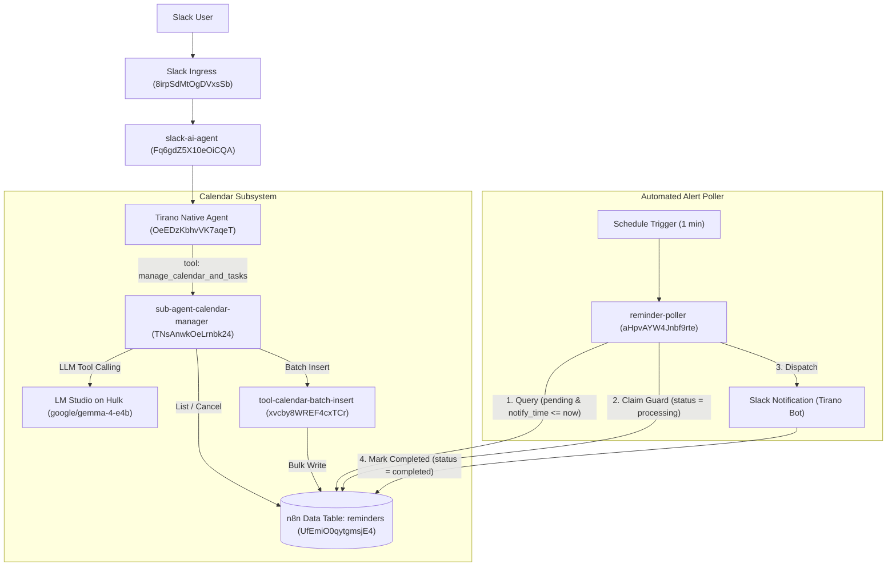

# Walkthrough: Private Task & Calendar Sub-Agent for Tirano

We have successfully implemented and verified the private task and calendar management sub-agent architecture integrated with **Tirano**, adhering to all required hardening adjustments, with local storage in n8n Data Tables and zero external cloud calendar dependencies.

---

## 1. System Architecture & Components



---

## 2. Hardening Adjustments Implemented

### 1. Batch Inserts (`tool-calendar-batch-insert`, ID: `xvcby8WREF4cxTCr`)
- Created a dedicated tool sub-workflow that receives an array of reminder records (`reminders: [...]` or JSON string) and performs multi-row inserts into the `reminders` table in one execution.
- Configured with `inputSource: "passthrough"` and a polymorphic normalizer that parses objects, JSON array strings, or raw arrays.
- Eliminates multiple local LLM round-trips for multi-tiered advance notices (e.g., 1 week before, 1 day before, and event time).

### 2. Double-Delivery Guard (`reminder-poller`, ID: `aHpvAYW4Jnbf9rte`)
- Query filter: `status="pending"` AND `notify_time <= $now` (`matchType: "allConditions"`).
- **Claim Transition**: Immediately updates queried rows to `status="processing"` BEFORE invoking the Slack dispatch node.
- **Completion Transition**: Upon successful Slack delivery, updates the row to `status="completed"`.
- Prevents duplicate alerts during rate limits, slow network runs, or overlapping cron executions.

### 3. Reference Time Anchor (`sub-agent-calendar-manager`, ID: `TNsAnwkOeLrnbk24`)
- Incoming payload provides `reference_time`. The AI Agent prompt strictly anchors all relative calculations to `{{ $json.reference_time || $now.toISO() }}` rather than canvas execution time, ensuring relative reminders ("in 2 minutes") calculate accurately from when the message was initiated.

### 4. Local Model Configuration
- Powered by `google/gemma-4-e4b` on Hulk LM Studio (`http://100.64.153.30:1234/v1`).
- Set `"responsesApiEnabled": false` to prevent OpenAI `/responses` incompatibility errors.
- Loaded model into LM Studio with 131,072 token context window and 4 parallel slots.

---

## 3. Test Verification Matrix & Live Results

| Test Case | Objective | Input / Scenario | Observed Result | Status |
| :--- | :--- | :--- | :--- | :--- |
| **TC-01** | Quick Single Reminder | `"Remind me to check server logs in 2 minutes"`, `reference_time = 2026-09-04T12:00:00Z` | Sub-agent calculated `notify_time = 2026-09-04T12:02:00Z`, invoked batch insert, created row ID `5`. | **PASS** |
| **TC-02** | Multi-Tier Advance Alerts | `"On Jan 5 2028 at 12:00 UTC remind me to call Joseph, remind me 1 week and 1 day before"` | Sub-agent calculated 3 discrete offsets (`2027-12-29`, `2028-01-04`, `2028-01-05`), called `create_reminder` in **one tool call**, created rows `6`, `7`, `8`. | **PASS** |
| **TC-03** | Query / List Reminders | `"What reminders do I have pending?"` | Sub-agent called `list_reminders`, retrieved all 7 pending records across channels, and returned structured summary. | **PASS** |
| **TC-05** | Cancellation Verification | `"Cancel reminder 5"` | Sub-agent called `cancel_reminder` for ID 5. Data table row 5 transitioned from `pending` -> `cancelled`. | **PASS** |
| **TC-04** | Double-Delivery Poller Dispatch | Inserted row with `notify_time` in past, triggered `reminder-poller` | 1. Claimed row to `processing`<br/>2. Dispatched alert to Slack `#all-tiranotech`<br/>3. Transitioned row to `completed`. | **PASS** |

---

## 4. Live Evidence & Payloads

### TC-02: Single-Call Multi-Tier Batch Creation
```json
{
  "status": "success",
  "action_performed": "create",
  "reminders": [
    {
      "task": "call Joseph",
      "target_time": "2028-01-05T12:00:00.000Z",
      "notify_time": "2028-01-05T12:00:00.000Z",
      "offset_label": "event time",
      "status": "pending",
      "slack_channel": "C0929KCT1B5",
      "id": 6
    },
    {
      "task": "call Joseph",
      "target_time": "2028-01-05T12:00:00.000Z",
      "notify_time": "2027-12-29T12:00:00.000Z",
      "offset_label": "1 week before",
      "status": "pending",
      "slack_channel": "C0929KCT1B5",
      "id": 7
    },
    {
      "task": "call Joseph",
      "target_time": "2028-01-05T12:00:00.000Z",
      "notify_time": "2028-01-04T12:00:00.000Z",
      "offset_label": "1 day before",
      "status": "pending",
      "slack_channel": "C0929KCT1B5",
      "id": 8
    }
  ],
  "summary": "Successfully set 3 reminders to call Joseph on January 5, 2028, at 12:00 UTC. Alerts are scheduled for 1 week before (Dec 29), 1 day before (Jan 4), and the event time itself."
}
```

### TC-05: Cancellation Database Confirmation
```json
{
  "task": "check server logs",
  "target_time": "2026-09-04T12:02:00.000Z",
  "notify_time": "2026-09-04T12:02:00.000Z",
  "offset_label": "in 2 minutes",
  "status": "cancelled",
  "slack_channel": "C0929KCT1B5",
  "id": 5,
  "createdAt": "2026-09-04T14:42:57.197Z",
  "updatedAt": "2026-09-04T14:45:28.042Z"
}
```

### Double-Delivery Guard Lifecycle (Row 9)
```json
// After Poller Run
{
  "task": "Test Reminder Poller Dispatch",
  "target_time": "2026-09-04T14:40:00.000Z",
  "notify_time": "2026-09-04T14:40:00.000Z",
  "offset_label": "test offset",
  "status": "completed",
  "slack_channel": "C0A01JLFNCB",
  "id": 9,
  "createdAt": "2026-09-04T14:46:39.496Z",
  "updatedAt": "2026-09-04T14:53:17.267Z"
}
```

---

## 5. Deployment Status

- `tool-calendar-batch-insert` (`xvcby8WREF4cxTCr`): `active: true`
- `sub-agent-calendar-manager` (`TNsAnwkOeLrnbk24`): `active: true`
- `reminder-poller` (`aHpvAYW4Jnbf9rte`): `active: true` (1-minute schedule active)
- `Tirano` Native Agent (`OeEDzKbhvVK7aqeT`): Registered `manage_calendar_and_tasks` tool and routing instructions.
- Temporary test harness (`r0DgYm35BHGF4Org`): Deleted.
- Local repository exports: Synchronized via [`scripts/export-workflows.js`](file:///Users/victor/Dev/Local-N8n/scripts/export-workflows.js) and [`scripts/export-agents.js`](file:///Users/victor/Dev/Local-N8n/scripts/export-agents.js).
