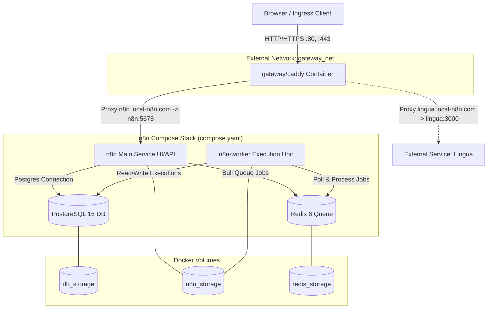

# Architecture & Topology Guide — Local-N8n

> **Scope**: System topology, container interaction, network isolation, persistent storage, and proxy routing.

---

## 1. System Topology Overview

The architecture decouples web ingress (Caddy reverse proxy), database/queue state (Postgres + Redis), application management (`n8n` main UI/API), and execution processing (`n8n-worker`).

---

## 2. Docker Network Architecture

The repository utilizes two network layers to ensure secure traffic segregation and external service connectivity:

1. **`gateway_net` (External Docker Network)**:
   - Created manually via `docker network create gateway_net`.
   - Shared between the central `gateway/` Caddy container and front-facing application instances (`n8n`, `lingua`).
   - Allows services in separate Docker Compose files to route through a single HTTPS ingress without exposing internal database ports.

2. **`default` (Internal Bridge Network)**:
   - Automatically created by `compose.yaml` for the n8n stack.
   - Internal communications between `n8n`, `n8n-worker`, `postgres`, and `redis` occur over this isolated network.
   - Database (`postgres`) and cache (`redis`) do NOT publish ports to the host interface.

---

## 3. Service Breakdown & Configuration

### A. `postgres` (Database)
- **Image**: `postgres:16`
- **Role**: Primary data store for n8n workflows, execution metadata, and credentials.
- **Initialization**: Mounts `./init-data.sh` to `/docker-entrypoint-initdb.d/init-data.sh`.
- **Healthcheck**: Uses `pg_isready` (interval: 5s, timeout: 5s, retries: 10).
- **Volume**: `db_storage` mounted to `/var/lib/postgresql/data`.

### B. `redis` (Queue Broker)
- **Image**: `redis:6-alpine`
- **Role**: In-memory message broker for n8n Queue Mode (Bull queue).
- **Healthcheck**: Uses `redis-cli ping` (interval: 5s, timeout: 5s, retries: 10).
- **Volume**: `redis_storage` mounted to `/data`.

### C. `n8n` (Main App & Web UI)
- **Image**: `docker.n8n.io/n8nio/n8n`
- **Role**: Serves the frontend UI, webhooks, and REST APIs; dispatches jobs to Redis.
- **Port Mapping**: `5678:5678` (accessible locally or via Caddy proxy).
- **Mode**: `EXECUTIONS_MODE=queue`.
- **Networks**: Attached to both `default` (internal) and `gateway_net` (external proxy).

### D. `n8n-worker` (Background Worker)
- **Image**: `docker.n8n.io/n8nio/n8n`
- **Command**: `worker`
- **Role**: Polls Redis for workflow execution jobs, executes nodes asynchronously, and persists results to PostgreSQL.
- **Scaling**: Can be horizontally scaled (`docker compose up -d --scale n8n-worker=N`).

### E. `gateway/caddy` (Central Reverse Proxy)
- **Image**: `caddy:latest`
- **Ports**: Host `80:80` & `443:443`.
- **Config**: Mounts `./Caddyfile` to `/etc/caddy/Caddyfile`.
- **Volumes**: `caddy_data` and `caddy_config` for TLS certificate persistence and dynamic state.

---

## 4. Queue Mode Execution Flow

1. **Trigger / Webhook**: External request or cron trigger hits `n8n` main service (via Caddy or directly on `:5678`).
2. **Job Enqueue**: `n8n` main formats the execution payload and pushes a job into Redis (`QUEUE_BULL_REDIS_HOST=redis`).
3. **Job Pick Up**: `n8n-worker` pulls the job from Redis, runs the node logic, and streams execution states.
4. **Persistence**: `n8n-worker` writes completion status and logs directly back to PostgreSQL (`postgres`).
