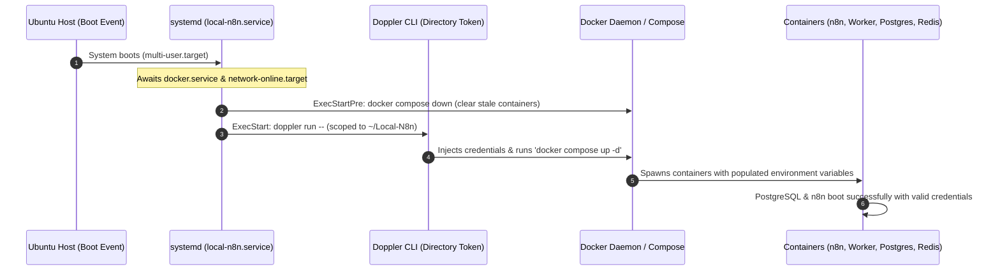
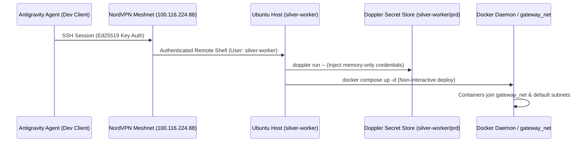

# Architecture & Topology Guide — Local-N8n

> **Scope**: System topology, container interaction, Zero-Trust network isolation, persistent storage, log management, and proxy routing.

---

## 1. System Topology Overview

The infrastructure decouples web ingress (Caddy reverse proxy bound to private VPN interfaces), state persistence (PostgreSQL 16 + Redis 6), web UI/API coordination (`n8n`), and asynchronous background execution (`n8n-worker`). Secrets are provided dynamically via Doppler CLI runtime injection.

```mermaid
graph TD
    Client[Client Browser / Device on NordVPN Meshnet] -->|HTTPS :443 TCP/UDP, HTTP :80| MeshnetIP["Meshnet Adapters (100.116.224.88 / 100.64.153.30)"]
    
    MeshnetIP --> GatewayCaddy[gateway/caddy Container]
    
    subgraph GatewayNet["External Network: gateway_net"]
        GatewayCaddy
    end
    
    subgraph DopplerEnv["Doppler Secret Engine"]
        DopplerCLI[Doppler CLI (silver-worker/prd)]
    end
    
    DopplerCLI -.->|Inject Env at Runtime| N8NMain
    DopplerCLI -.->|Inject Env at Runtime| N8NWorker
    DopplerCLI -.->|Inject Credentials| Postgres
    
    GatewayCaddy -->|Proxy n8n.local-n8n.com -> n8n:5678 (flush_interval -1)| N8NMain[n8n Main Service UI/API]
    GatewayCaddy -.->|Proxy lingua.local-n8n.com -> lingua:3000| LinguaApp[External Service: Lingua]
    
    subgraph N8NStack["n8n Compose Stack (compose.yaml)"]
        N8NMain
        N8NWorker[n8n-worker Execution Unit]
        Postgres[(PostgreSQL 16 DB)]
        Redis[(Redis 6 Bull Queue)]
        
        N8NMain -->|Internal DB Connection| Postgres
        N8NMain -->|Dispatch Bull Queue Jobs| Redis
        N8NWorker -->|Poll & Consume Jobs| Redis
        N8NWorker -->|Read/Write Executions| Postgres
    end
    
    subgraph NamedVolumes["Docker Volumes & Storage"]
        Postgres --- VolDB[(db_storage)]
        N8NMain --- VolN8n[(n8n_storage)]
        N8NWorker --- VolN8n
        N8NMain --- VolFiles[(n8n_local_files -> /files)]
        N8NWorker --- VolFiles
        Redis --- VolRedis[(redis_storage)]
        GatewayCaddy --- VolCaddyData[(caddy_data)]
        GatewayCaddy --- VolCaddyConfig[(caddy_config)]
    end
```

---

## 2. Docker Network Architecture & Zero-Trust Isolation

The system enforces strict traffic isolation across multiple network and adapter boundaries:

1. **Zero-Trust Meshnet Ingress Layer**:
   - Instead of listening on `0.0.0.0` (which would expose services to the local Wi-Fi / LAN), Caddy binds strictly to the host machine's NordVPN Meshnet static IP addresses (`100.116.224.88` and `100.64.153.30`).
   - Supports both TCP and UDP for port 443 to enable HTTP/3 QUIC acceleration over the VPN mesh.
   - The host machine remains completely invisible to unauthenticated LAN devices.

2. **`gateway_net` (Shared External Bridge)**:
   - Created independently via `docker network create gateway_net`.
   - Shared between the central reverse proxy (`gateway/docker-compose.yaml`) and web-facing frontend services (`n8n` in `compose.yaml`, `lingua`).
   - Allows independent microservices to be started, stopped, or upgraded without recreating proxy containers.

3. **`default` (Isolated Application Bridge)**:
   - Created automatically by `compose.yaml`.
   - All internal inter-service communication (`n8n` <-> `redis`, `n8n` <-> `postgres`, `n8n-worker` <-> `postgres`) occurs exclusively over this private subnet.
   - Neither PostgreSQL (`5432`) nor Redis (`6379`) publishes ports to the host interface.

---

## 3. Service Breakdown & Configuration

### A. `gateway/caddy` (Central Reverse Proxy)
- **Image**: `caddy:latest`
- **Restart Policy**: `unless-stopped`
- **Network**: `gateway_net`
- **Port Bindings**:
  - `100.116.224.88:80:80`, `100.116.224.88:443:443` (TCP) & `100.116.224.88:443:443/udp` (HTTP/3)
  - `100.64.153.30:80:80`, `100.64.153.30:443:443` (TCP) & `100.64.153.30:443:443/udp` (HTTP/3)
- **Volumes**: `caddy_data:/data`, `caddy_config:/config`, `./Caddyfile:/etc/caddy/Caddyfile`
- **Configuration**: Uses internal TLS certificate generation (`local_certs`) and `flush_interval -1` for real-time WebSocket communication with the n8n frontend.

### B. `postgres` (Relational Database)
- **Image**: `postgres:16`
- **Restart Policy**: `always`
- **Logging Policy**: `json-file` (max-size: 10m, max-file: 3)
- **Initialization**: Mounts [`./init-data.sh`](file:///Users/victor/Dev/Local-N8n/init-data.sh) to `/docker-entrypoint-initdb.d/init-data.sh` to initialize the database and grant privileges to `POSTGRES_NON_ROOT_USER`.
- **Healthcheck**: `pg_isready -h localhost -U ${POSTGRES_USER} -d ${POSTGRES_DB}` (interval: 5s, timeout: 5s, retries: 10).
- **Volume**: `db_storage:/var/lib/postgresql/data`.

### C. `redis` (Queue Broker)
- **Image**: `redis:6-alpine`
- **Restart Policy**: `always`
- **Logging Policy**: `json-file` (max-size: 10m, max-file: 3)
- **Healthcheck**: `redis-cli ping` (interval: 5s, timeout: 5s, retries: 10).
- **Volume**: `redis_storage:/data`.

### D. `n8n` (Main UI & Webhook Orchestrator)
- **Image**: `docker.n8n.io/n8nio/n8n`
- **Restart Policy**: `always`
- **Port Mapping**: `5678:5678` (host local access) and proxied via `gateway_net`.
- **Mode**: `EXECUTIONS_MODE=queue` with Redis backend.
- **Data Pruning Guardrails**:
  - `EXECUTIONS_DATA_PRUNE=true`
  - `EXECUTIONS_DATA_MAX_AGE=168` (retains execution logs for 7 days)
  - `EXECUTIONS_DATA_PRUNE_MAX_COUNT=50000`
- **Volumes**:
  - `n8n_storage:/home/node/.n8n` (workflow definitions, credentials, internal settings)
  - `n8n_local_files:/files` (shared local file read/write access for workflows)
- **Logging Policy**: `json-file` (max-size: 10m, max-file: 3)
- **Dependencies**: Depends on healthy `redis` and `postgres` containers before booting.

### E. `n8n-worker` (Execution Processing Unit)
- **Image**: `docker.n8n.io/n8nio/n8n`
- **Command**: `worker`
- **Role**: Pulls queued execution jobs from Redis Bull queue, executes workflow steps, and writes results to PostgreSQL.
- **Scaling**: Horizontally scalable using `docker compose up -d --scale n8n-worker=N`.
- **Storage**: Shares identical `n8n_storage` and `n8n_local_files` volumes as the main n8n instance.
- **Dependencies**: Depends on `n8n` main service being up.

---

## 4. Host Boot Persistence & Startup Sequence

To ensure that the n8n stack restarts automatically after a host machine reboot without bypassing Doppler secret injection, execution is managed by a host-level systemd unit (`/etc/systemd/system/local-n8n.service`).

### Startup Sequence Flow


### Systemd Service Specification (`/etc/systemd/system/local-n8n.service`)
- **Unit Configuration**: Ordered `After=docker.service network-online.target` and `Requires=docker.service`.
- **Pre-execution Clean (`ExecStartPre`)**: Runs `/usr/bin/docker compose down` to terminate any daemon-restarted containers that launched without Doppler environment injection.
- **Runtime Injection (`ExecStart`)**: Runs `/usr/bin/doppler run -- /usr/bin/docker compose up -d` under user `silver-worker` within `/home/silver-worker/Local-N8n`.
- **Graceful Shutdown (`ExecStop`)**: Executes `/usr/bin/docker compose down` with `TimeoutStopSec=60` on host reboot or shutdown.

---

## 5. Execution Flow & Lifecycle

1. **Trigger Reception**: An incoming webhook or scheduled cron fires on the main `n8n` instance (routed via Caddy over Meshnet on `https://n8n.local-n8n.com` or localhost:5678).
2. **Queueing**: The `n8n` main process creates a task payload and enqueues a job into Redis (`QUEUE_BULL_REDIS_HOST=redis`).
3. **Execution**: One or more `n8n-worker` instances pick up the job from the Redis Bull queue, execute the node logic, and stream progress events.
4. **Result Storage**: The worker commits output data and execution history directly to PostgreSQL.
5. **Pruning & Maintenance**: Every hour, n8n's background pruner deletes execution history older than 168 hours or exceeding 50,000 entries, preventing unconstrained database growth.

---

## 6. Ecosystem & Agent Integrations

```mermaid
graph TD
    subgraph AgentHost["Dev Client / IDE (Antigravity)"]
        AgyAgent["Antigravity Agent"]
        MCPClient["n8n-mcp Client Wrapper"]
        AgyAgent <-->|MCP Protocol| MCPClient
    end

    MCPClient -->|HTTPS API over Meshnet (100.116.224.88)| GatewayCaddy
    GatewayCaddy -->|Proxy| N8NMain

    subgraph SandboxHost["Isolated Code Execution (Host / sysbox-runc)"]
        N8NMain -->|HTTP POST /v1/sandboxes :3200| SandboxAPI["sandbox-api"]
        SandboxAPI <-->|gRPC mTLS| SandboxRunner["sandbox-runner (sysbox)"]
        SandboxRunner -->|Spawns| MicroBox["Isolated Code Sandbox (JS / Python)"]
    end
```

1. **Antigravity Model Context Protocol (MCP)**:
   - Antigravity pair programming agents interface directly with the production n8n instance via the `meshnet-n8n` MCP server.
   - All interactions run through `n8n-mcp` over the encrypted Meshnet gateway (`https://n8n.local-n8n.com`), allowing agents to inspect node schemas (`get_node_schema`), validate active executions (`execute_workflow`), and manage workflows programmatically without exposing raw database credentials.
2. **Self-Hosted Isolated Code Sandbox**:
   - For code-execution nodes and AI Assistant tools, n8n dispatches JavaScript/Python code execution to the companion service (`n8n-sandbox-service`) in `/home/silver-worker/Local-N8n/sandbox`.
   - Listens on `http://sandbox-api:3200` attached to `gateway_net` and bound on the host to `127.0.0.1:3200` and `100.116.224.88:3200`.
   - Guaranteed isolated from host root and database volumes via internal `sandbox_service` Docker bridge.

---

## 7. Agent Remote Connection Model & Operational Safeguards

### A. Remote Host Infrastructure
- **Server Identity**: `silver-worker` (Dell Precision 5480)
- **Operating System**: Ubuntu Server (Linux `7.0.0-30-generic` x86_64)
- **Meshnet Private IP**: `100.116.224.88`
- **Application Workdir**: `/home/silver-worker/Local-N8n`
- **Sandbox Workdir**: `/home/silver-worker/Local-N8n/sandbox`

### B. Agent Connection Architecture


### C. Operational Guardrails & Safeguards
1. **Zero-Disk Secret Guarantee**:
   - Plaintext credentials and tokens must never be written to `.env` or disk files.
   - The directory `/home/silver-worker/Local-N8n` is bound to Doppler service tokens scoped to `silver-worker/prd`.
2. **Dual-Stack Host Persistence**:
   - `/etc/systemd/system/local-n8n.service`: Manages Postgres, Redis, n8n, and n8n-worker.
   - `/etc/systemd/system/local-n8n-sandbox.service`: Manages sandbox-api, sandbox-runner, and registry with `After=local-n8n.service`.
3. **Execution Quarantining**:
   - AI-generated code execution is strictly routed to `http://sandbox-api:3200` and executed inside isolated runner containers. Untrusted code cannot touch host mounts or Postgres data volumes.
4. **Staging Safety Rule**:
   - Any workflow generated via agent API/MCP must retain `active: false` until validation checks succeed.

