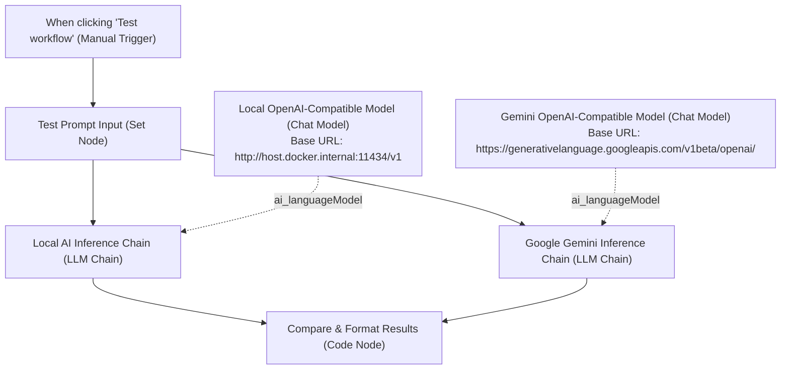

# Workflow: AI-TESTING

A multi-provider AI evaluation workflow designed to run comparative inference side-by-side between **Local AI (Ollama / vLLM / LocalAI)** and **Google Gemini** using OpenAI-compatible connectors.

---

## 1. Overview & Specifications

| Property | Value |
| :--- | :--- |
| **Workflow Name** | `AI-TESTING` |
| **Remote ID** | `5rRB16PM6Tx07ZB0` |
| **Default State** | `active: false` (Manual Trigger Testing Workflow) |
| **Primary Trigger** | Manual Click (`When clicking 'Test workflow'`) |
| **Direct Canvas Link** | [https://n8n.local-n8n.com/workflow/5rRB16PM6Tx07ZB0](https://n8n.local-n8n.com/workflow/5rRB16PM6Tx07ZB0) |

---

## 2. Architecture & Inference Topology



---

## 3. Configured Providers

### 1. Local AI Inference
- **Chain**: `Local AI Inference Chain` (`n8n-nodes-langchain.chainLlm`)
- **Subnode**: `Local OpenAI-Compatible Model` (`n8n-nodes-langchain.lmChatOpenAi`)
- **Base URL**: `http://host.docker.internal:11434/v1` (Accessible from within Docker container to host machine Ollama/LocalAI)
- **Default Model**: `llama3.2`
- **Authentication**: Requires any placeholder OpenAI credential (e.g. `ollama`).

### 2. Google Gemini Inference
- **Chain**: `Google Gemini Inference Chain` (`n8n-nodes-langchain.chainLlm`)
- **Subnode**: `Gemini OpenAI-Compatible Model` (`n8n-nodes-langchain.lmChatOpenAi`)
- **Base URL**: `https://generativelanguage.googleapis.com/v1beta/openai/`
- **Default Model**: `gemini-2.5-flash`
- **Authentication**: Requires standard OpenAI credential storing your Google AI Studio API key.

---

## 4. Execution & Output Format

When executed, the **Compare & Format Results** node merges outputs into a structured comparison:

```json
{
  "benchmark": "AI Inference Provider Comparison",
  "prompt": "Explain quantum computing in two concise sentences.",
  "timestamp": "2026-08-31T22:53:10.950Z",
  "providers": {
    "local_openai_compatible": {
      "model": "Local Model (e.g. llama3.2 / ollama / vLLM)",
      "endpoint": "http://host.docker.internal:11434/v1",
      "response": "Quantum computing uses qubits that exist in multiple states simultaneously via superposition. This enables solving certain complex problems exponentially faster than classical computers."
    },
    "google_gemini_openai_compatible": {
      "model": "gemini-2.5-flash",
      "endpoint": "https://generativelanguage.googleapis.com/v1beta/openai/",
      "response": "Quantum computing harnesses the principles of quantum mechanics, like superposition and entanglement, to process complex data. This allows quantum computers to solve specialized calculations far beyond the reach of traditional computers."
    }
  }
}
```
