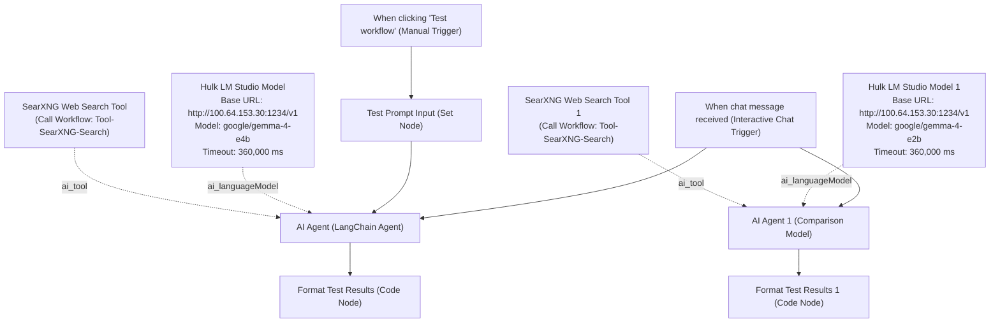

# Workflow: AI-TESTING

A local AI testing and evaluation workflow connecting **n8n** to **LM Studio on Hulk (`100.64.153.30:1234`)** over private NordVPN Meshnet, augmented with real-time web search capabilities via our self-hosted **SearXNG** sub-workflow tool.

---

## 1. Overview & Specifications

| Property | Value |
| :--- | :--- |
| **Workflow Name** | `AI-TESTING` |
| **Remote ID** | `5rRB16PM6Tx07ZB0` |
| **Default State** | `active: false` (Manual & Interactive Chat Testing Workflow) |
| **Input Methods** | 1. **Interactive Chat UI** (`When chat message received`) 2. **Canvas Prompt Input** (`When clicking 'Test workflow'` + Set Node) |
| **Direct Canvas Link** | [https://n8n.local-n8n.com/workflow/5rRB16PM6Tx07ZB0](https://n8n.local-n8n.com/workflow/5rRB16PM6Tx07ZB0) |
| **Search Engine Tool** | **SearXNG Sub-Workflow Tool** (`Tool-SearXNG-Search` / `hk8OViFZWBnveSCF`) |
| **Timeout Allowance** | **6 Minutes** (`timeout: 360000ms`, `executionTimeout: 600s`) for model cold loading into GPU memory (RTX 4070) |

---

## 2. Architecture & Inference Topology

---

## 3. How to Input Text & Test the AI Connection

You can test custom prompts using either of two built-in methods:

### Method 1: Interactive Chat UI (Recommended)
1. Open the workflow canvas: [https://n8n.local-n8n.com/workflow/5rRB16PM6Tx07ZB0](https://n8n.local-n8n.com/workflow/5rRB16PM6Tx07ZB0).
2. Click the **"Chat"** tab/button located in the bottom-right corner of the canvas (or double-click the **When chat message received** node and click *Open Chat*).
3. Type your prompt into the input field and hit **Enter** (e.g., `web search the current canyon lake levels 78133`).
4. The AI agent will autonomously invoke the SearXNG web search tool, fetch real-time search results, and synthesize a factual response.

### Method 2: In-Canvas Test Workflow Button
1. Open the **Test Prompt Input** Set node.
2. Edit the `prompt` field value to whatever question or prompt you want to send.
3. Click **"Test workflow"** at the bottom of the canvas.
4. The **Format Test Results** node will display structured execution output with metadata and timestamps.

---

## 4. Hardware & Tool Specifications

- **Compute Host**: Hulk (`100.64.153.30:1234`) running LM Studio local server on Nvidia GeForce RTX 4070.
- **Search Tool Host**: `searxng` container on `gateway_net` (`http://searxng:8080`), aggregated via dedicated sub-workflow `Tool-SearXNG-Search`.
- **Cold Load Buffer**:
  - Node HTTP Request Timeout: `360,000 ms` (6 minutes)
  - Workflow Execution Timeout ceiling: `600 seconds` (10 minutes)
  - Max Retries: `2`
