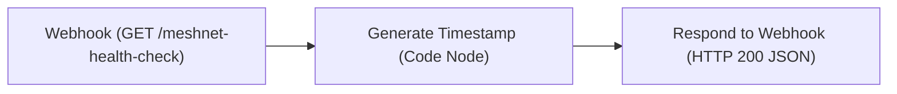

# Workflow: Meshnet-Health-Check

An automated health check workflow providing an HTTP GET endpoint over the private NordVPN Meshnet tunnel to verify n8n web ingress, Redis Bull queue processing, and database execution recording.

---

## 1. Overview & Specifications

| Property | Value |
| :--- | :--- |
| **Workflow Name** | `Meshnet-Health-Check` |
| **Remote ID** | `XRDcHq3GIEZQKprT` |
| **Default State** | `active: false` (Activate via UI or API when ready) |
| **HTTP Method** | `GET` |
| **Webhook Path** | `/webhook/meshnet-health-check` (or `/webhook-test/meshnet-health-check` for testing) |
| **Direct Canvas Link** | [https://n8n.local-n8n.com/workflow/XRDcHq3GIEZQKprT](https://n8n.local-n8n.com/workflow/XRDcHq3GIEZQKprT) |

---

## 2. Node Topology



### Node Details
1. **Webhook (`n8n-nodes-base.webhook`)**:
   - Accepts `GET` requests on path `meshnet-health-check`.
   - Response Mode: `responseNode` (delegates HTTP response payload to the final node).
2. **Generate Timestamp (`n8n-nodes-base.code`)**:
   - Executes JavaScript generating the server timestamp and health metadata:
     ```javascript
     return [{
       json: {
         status: 'healthy',
         timestamp: new Date().toISOString(),
         service: 'local-n8n-meshnet',
         executions_mode: 'queue'
       }
     }];
     ```
3. **Respond to Webhook (`n8n-nodes-base.respondToWebhook`)**:
   - Responds with HTTP 200 containing the JSON payload from the code node.

---

## 3. How to Test

```bash
# Production Active Webhook
curl -k https://n8n.local-n8n.com/webhook/meshnet-health-check

# Test Webhook (when canvas test session is active)
curl -k https://n8n.local-n8n.com/webhook-test/meshnet-health-check
```

**Expected Response**:
```json
{
  "status": "healthy",
  "timestamp": "2026-08-31T22:42:37.214Z",
  "service": "local-n8n-meshnet",
  "executions_mode": "queue"
}
```
