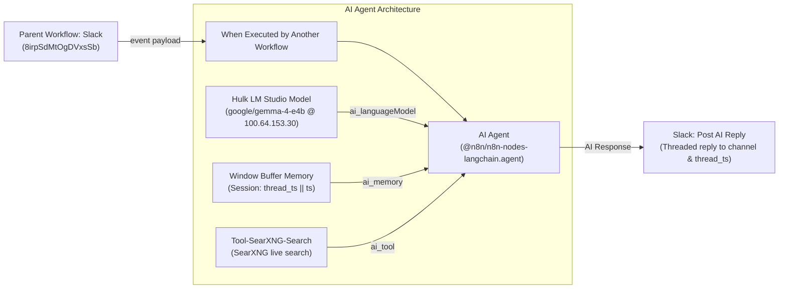

# Workflow: slack-ai-agent

A production conversational AI sub-workflow designed to process Slack inbound messages, retain multi-turn conversation memory by Slack thread, perform real-time web searches using SearXNG, and post responses directly back to the originating Slack channel and thread.

---

## 1. Overview & Specifications

| Property | Value |
| :--- | :--- |
| **Workflow Name** | `slack-ai-agent` |
| **Remote ID** | `Fq6gdZ5X10eOiCQA` |
| **Default State** | `active: false` (Staging / Safe State) |
| **Trigger Type** | `When Executed by Another Workflow` (`executeWorkflowTrigger` v1.1) |
| **AI Model** | OpenAI Chat Model (`@n8n/n8n-nodes-langchain.lmChatOpenAi` v1.3) pointing to Hulk LM Studio (`google/gemma-4-e4b`) |
| **Execution Timeout** | `360000` ms (6 minutes for cold load tolerance) |
| **Memory** | `Window Buffer Memory` (`memoryBufferWindow` v1.3) scoped to session key `{{ $json.event.thread_ts || $json.event.ts }}` |
| **Web Search Tool** | `Tool-SearXNG-Search` custom code tool (`http://searxng:8080/search`) |
| **Slack Egress** | `Slack: Post AI Reply` (`n8n-nodes-base.slack` v2.2) via `TiranoTech` (`slackOAuth2Api`) |
| **Direct Canvas Link** | [https://n8n.local-n8n.com/workflow/Fq6gdZ5X10eOiCQA](https://n8n.local-n8n.com/workflow/Fq6gdZ5X10eOiCQA) |

---

## 2. Architecture & Flow



---

## 3. Sub-Workflow Inputs & Payloads

The sub-workflow accepts a JSON object with an `event` property conforming to standard Slack Event Callback specifications:

```json
{
  "event": {
    "type": "message",
    "channel": "C012345678",
    "user": "U012345678",
    "text": "What are the latest water levels at Canyon Lake?",
    "ts": "1725161000.000200",
    "thread_ts": "1725161000.000200"
  }
}
```

### Contextual Memory & Threading
- **Session ID**: Evaluates `{{ $('When Executed by Another Workflow').item.json.event?.thread_ts || $('When Executed by Another Workflow').item.json.event?.ts }}`.
- **Multi-Turn Context**: All follow-up replies in the same Slack thread automatically share conversational history (up to 5 interactions).
- **Zero Disk Secrets**: References `hvK9eAePdrKHSgMD` (OpenAI Account on Hulk) and `aSF0sVdzDzhmMBK3` (TiranoTech Slack OAuth2).
