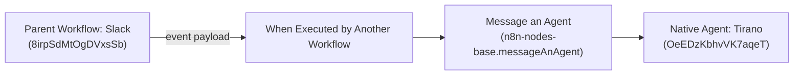

# Workflow: slack-ai-agent

A production conversational AI sub-workflow designed to receive incoming Slack events from the `Slack` webhook router and invoke the native n8n Agent **Tirano** (`OeEDzKbhvVK7aqeT`) via the `messageAnAgent` node.

---

## 1. Overview & Specifications

| Property | Value |
| :--- | :--- |
| **Workflow Name** | `slack-ai-agent` |
| **Remote ID** | `Fq6gdZ5X10eOiCQA` |
| **Status** | `active: true` |
| **Trigger Type** | `When Executed by Another Workflow` (`executeWorkflowTrigger` v1.1) |
| **Agent Invocation** | `Message an Agent` (`n8n-nodes-base.messageAnAgent` v3.1) targeting native agent **Tirano** (`OeEDzKbhvVK7aqeT`) |
| **Direct Canvas Link** | [https://n8n.local-n8n.com/workflow/Fq6gdZ5X10eOiCQA](https://n8n.local-n8n.com/workflow/Fq6gdZ5X10eOiCQA) |

---

## 2. Architecture & Flow



---

## 3. Sub-Workflow Inputs & Payloads

The sub-workflow accepts a JSON object with an `event` property conforming to standard Slack Event Callback specifications:

```json
{
  "event": {
    "type": "app_mention",
    "channel": "C012345678",
    "user": "U012345678",
    "text": "What is the current date?",
    "ts": "1725161000.000200",
    "thread_ts": "1725161000.000200"
  }
}
```

The `messageAnAgent` node extracts the query expression:
`{{ $("When Executed by Another Workflow").item.json.event?.text || $("When Executed by Another Workflow").item.json.text || $json.event?.text || $json.text }}`
and forwards it directly to the native agent runtime.
