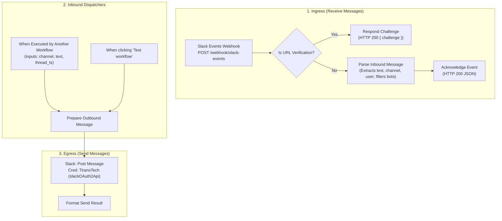

# Workflow: Slack

A production n8n integration workflow for sending and receiving messages in Slack using the configured **`TiranoTech`** (`slackOAuth2Api`) credentials.

---

## 1. Overview & Specifications

| Property | Value |
| :--- | :--- |
| **Workflow Name** | `Slack` |
| **Remote ID** | `8irpSdMtOgDVxsSb` |
| **Default State** | `active: false` (Activate when configuring Slack Event Subscriptions) |
| **Ingress Webhook** | `POST https://n8n.local-n8n.com/webhook/slack-events` |
| **Sub-Workflow Trigger** | `When Executed by Another Workflow` (`executeWorkflowTrigger` v1.1) |
| **Credentials Used** | `TiranoTech` (`slackOAuth2Api`, ID: `aSF0sVdzDzhmMBK3`) |
| **Direct Canvas Link** | [https://n8n.local-n8n.com/workflow/8irpSdMtOgDVxsSb](https://n8n.local-n8n.com/workflow/8irpSdMtOgDVxsSb) |

---

## 2. Architecture & Topology



---

## 3. Capabilities

### A. Receiving Messages (Slack Event Subscriptions)
1. **URL Verification Handshake**: Automatically responds to Slack's challenge handshake when you register `https://n8n.local-n8n.com/webhook/slack-events` in **Slack App Settings > Event Subscriptions > Request URL**.
2. **Inbound Message Parsing**:
   - Parses `channel`, `user`, `text`, `ts`, and `thread_ts`.
   - Filters out bot echo events (`bot_id` or `subtype: "bot_message"`) to prevent recursive feedback loops.

### B. Sending Messages (Sub-Workflow / Direct Action)
Can be invoked by any parent workflow (such as AI agents or monitoring triggers) with the following inputs:
- `channel` *(string, default: `"general"`)*: Target Slack channel name (e.g. `general` or `C01234567`) or channel ID.
- `text` *(string)*: Message text body to send.
- `thread_ts` *(string, optional)*: Slack thread timestamp to post a threaded reply.

---

## 4. How to Test

### Test 1: Slack URL Challenge Verification
```bash
curl -k -X POST https://n8n.local-n8n.com/webhook-test/slack-events \
  -H "Content-Type: application/json" \
  -d '{"type": "url_verification", "challenge": "test_challenge_abc123"}'
```

### Test 2: Inbound Message Ingestion
```bash
curl -k -X POST https://n8n.local-n8n.com/webhook-test/slack-events \
  -H "Content-Type: application/json" \
  -d '{
    "type": "event_callback",
    "event": {
      "type": "message",
      "channel": "C12345678",
      "user": "U12345678",
      "text": "Hello from Slack!",
      "ts": "1725160000.000100"
    }
  }'
```

### Test 3: Sub-Workflow Execution from Another Workflow
In any parent workflow, add an **Execute Workflow** node:
- **Workflow**: `Slack` (`8irpSdMtOgDVxsSb`)
- **Workflow Inputs**:
  - `channel`: `general`
  - `text`: `Automated alert notification from n8n`
