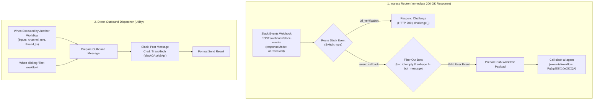

# Workflow: Slack

A production n8n integration workflow acting as the **Slack Ingress Router & Dispatcher**. It handles Slack webhook event subscriptions, responds immediately with HTTP 200 to satisfy Slack's 3-second SLA, filters out bot messages to prevent recursive loops, and dispatches legitimate events to the `slack-ai-agent` sub-workflow.

---

## 1. Overview & Specifications

| Property | Value |
| :--- | :--- |
| **Workflow Name** | `Slack` |
| **Remote ID** | `8irpSdMtOgDVxsSb` |
| **Default State** | `active: false` (Activate when configuring Slack Event Subscriptions) |
| **Public Webhook Ingress (Cloudflare Tunnel)** | `POST https://webhook.tiranotech.com/webhook/slack-events` |
| **Internal Webhook Ingress (Meshnet)** | `POST https://n8n.local-n8n.com/webhook/slack-events` |
| **Response Mode** | `onReceived` (Immediate HTTP 200 to clear Slack 3s SLA) |
| **Sub-Workflow Dispatch** | Calls `slack-ai-agent` (`Fq6gdZ5X10eOiCQA`) |
| **Credentials Used** | `TiranoTech` (`slackOAuth2Api`, ID: `aSF0sVdzDzhmMBK3`) |
| **Direct Canvas Link** | [https://n8n.local-n8n.com/workflow/8irpSdMtOgDVxsSb](https://n8n.local-n8n.com/workflow/8irpSdMtOgDVxsSb) |

---

## 2. Architecture & Topology



---

## 3. Ingress & Routing Guardrails

### A. Immediate Webhook Acknowledgment
- Configured with `responseMode: "onReceived"`.
- Instantly returns `200 OK` to Slack to prevent webhook retry spam and timeout errors when GPU LLMs experience cold loads.

### B. Challenge Verification & Event Routing
- Uses a `Switch` node matching on `$json.body.type`:
  - `url_verification`: Routed to challenge verification branch.
  - `event_callback`: Routed to bot guardrail filter branch.

### C. Bot Echo Loop Guardrail
- `Filter Out Bots` validates:
  - `leftValue`: `{{ $json.body?.event?.bot_id }}` (operator: `empty`)
  - `leftValue`: `{{ $json.body?.event?.subtype }}` (operator: `notEquals`, rightValue: `bot_message`)
- Drops all bot notifications and outgoing replies to ensure zero recursive loops.

---

## 4. How to Test

### Test 1: Public Slack URL Challenge Verification (Cloudflare Tunnel)
```bash
curl -X POST https://webhook.tiranotech.com/webhook/slack-events \
  -H "Content-Type: application/json" \
  -d '{"type": "url_verification", "challenge": "test_challenge_abc123"}'
```

### Test 2: Internal / Canvas Test Webhook (Meshnet)
```bash
curl -k -X POST https://n8n.local-n8n.com/webhook-test/slack-events \
  -H "Content-Type: application/json" \
  -d '{"type": "url_verification", "challenge": "test_challenge_abc123"}'
```

### Test 3: Inbound Message Ingestion (Simulated User Event Callback)
```bash
curl -X POST https://webhook.tiranotech.com/webhook/slack-events \
  -H "Content-Type: application/json" \
  -d '{
    "type": "event_callback",
    "event": {
      "type": "message",
      "channel": "C12345678",
      "user": "U12345678",
      "text": "What is the weather in Austin today?",
      "ts": "1725160000.000100"
    }
  }'
```
