# Workflow: Slack

A production n8n integration workflow acting as the **Slack Ingress Router, Dispatcher & Execution Cancellation Controller**. It handles Slack webhook event subscriptions, responds immediately with HTTP 200 to satisfy Slack's 3-second SLA, filters out bot messages to prevent recursive loops, routes cancellation commands to abort active runs, and dispatches legitimate queries to the `slack-ai-agent` sub-workflow.

---

## 1. Overview & Specifications

| Property | Value |
| :--- | :--- |
| **Workflow Name** | `Slack` |
| **Remote ID** | `8irpSdMtOgDVxsSb` |
| **Default State** | `active: true` |
| **Public Webhook Ingress (Cloudflare Tunnel)** | `POST https://webhook.tiranotech.com/webhook/slack-events` |
| **Internal Webhook Ingress (Meshnet)** | `POST https://n8n.local-n8n.com/webhook/slack-events` |
| **Response Mode** | `responseNode` (Immediate `Acknowledge Event` HTTP 200 response to clear Slack 3s SLA) |
| **Sub-Workflow Dispatch** | Calls `slack-ai-agent` (`Fq6gdZ5X10eOiCQA`) |
| **Cancellation Commands** | `stop`, `cancel`, `/stop`, `/cancel`, `abort`, `/abort` |
| **Credentials Used** | `TiranoTech` (`slackOAuth2Api`, ID: `aSF0sVdzDzhmMBK3`) |
| **Direct Canvas Link** | [https://n8n.local-n8n.com/workflow/8irpSdMtOgDVxsSb](https://n8n.local-n8n.com/workflow/8irpSdMtOgDVxsSb) |

---

## 2. Architecture & Topology

```mermaid
graph TD
    subgraph Ingress["1. Ingress Router & Cancellation Controller"]
        Webhook["Slack Events Webhook<br/>POST /webhook/slack-events<br/>(responseMode: responseNode)"] --> RouteEvent{"Route Slack Event<br/>(Switch: type)"}
        
        RouteEvent -- "url_verification" --> RespondChallenge["Respond Challenge<br/>(HTTP 200 { challenge })"]
        RouteEvent -- "event_callback" --> FilterBots{"Filter Out Bots<br/>(bot_id empty & subtype != bot_message)"}
        
        FilterBots -- "Valid User Event" --> AckImmediate["Acknowledge Event<br/>(HTTP 200 status: ok)"]
        AckImmediate --> PrepSubPayload["Prepare Sub-Workflow Payload<br/>(Extracts text & evaluates isCancel)"]
        
        PrepSubPayload --> RouteIntent{"Route Message Intent<br/>(If: isCancel == true)"}
        
        RouteIntent -- "isCancel: true" --> CancelExecutions["Cancel Active Executions<br/>(POST /api/v1/executions/:id/stop)"]
        CancelExecutions --> PostCancelReply["Slack: Post Cancel Reply<br/>(🛑 Request cancelled.)"]
        
        RouteIntent -- "isCancel: false" --> CallSubWf["Call slack-ai-agent<br/>(executeWorkflow: Fq6gdZ5X10eOiCQA)"]
    end

    subgraph DirectDispatcher["2. Direct Outbound Dispatcher (Utility)"]
        SubWfTrig["When Executed by Another Workflow<br/>(inputs: channel, text, thread_ts)"] --> PrepMsg["Prepare Outbound Message"]
        ManualTrig["When clicking 'Test workflow'"] --> PrepMsg
        PrepMsg --> SlackPost["Slack: Post Message<br/>Cred: TiranoTech (slackOAuth2Api)"]
        SlackPost --> FormatResult["Format Send Result"]
    end
```



---

## 3. Ingress & Routing Guardrails

### A. Immediate Webhook Acknowledgment
- Configured with `responseMode: "responseNode"` and an immediate `Acknowledge Event` node returning `{"status": "ok"}` in <10ms.
- Satisfies Slack's strict 3-second SLA to prevent retry loops during heavy GPU generation on Hulk.

### B. Bot Echo Loop Guardrail
- `Filter Out Bots` validates:
  - `leftValue`: `{{ $json.body?.event?.bot_id }}` (operator: `empty`)
  - `leftValue`: `{{ $json.body?.event?.subtype }}` (operator: `notEquals`, rightValue: `bot_message`)
- Drops all bot notifications and outgoing replies to ensure zero recursive loops.

### C. Live Execution Cancellation ("Stop Execution")
- `Prepare Sub-Workflow Payload` strips Slack user tags (`<@U0A03MFDL3H>`) and tests text against `/^(stop|cancel|\/stop|\/cancel|abort|\/abort)$/i`.
- `Route Message Intent` branches:
  - **Cancel Command**: Queries active running runs on `http://n8n:5678/api/v1/executions?status=running&workflowId=Fq6gdZ5X10eOiCQA`, matches by `thread_ts` or channel, invokes `POST /api/v1/executions/{id}/stop`, and sends a confirmation reply (`🛑 Request cancelled.` or `ℹ️ No active request found to cancel.`).
  - **Regular Prompt**: Dispatches asynchronously to `slack-ai-agent` without blocking the webhook.

---

## 4. How to Test

### Test 1: Cancellation of an Active Generation
1. Send a complex/long query in a Slack thread.
2. Reply `stop` or `cancel` in the same thread.
3. The parent workflow intercepts the command, immediately terminates the running child execution, and replies in-thread: `🛑 Request cancelled.`.

### Test 2: Inbound Message Ingestion (Simulated Webhook)
```bash
curl -k -X POST https://n8n.local-n8n.com/webhook/slack-events \
  -H "Content-Type: application/json" \
  -d '{
    "type": "event_callback",
    "event": {
      "type": "message",
      "channel": "all-tiranotech",
      "user": "U12345678",
      "text": "What is the latest news regarding n8n?",
      "ts": "1725163000.000100"
    }
  }'
```
