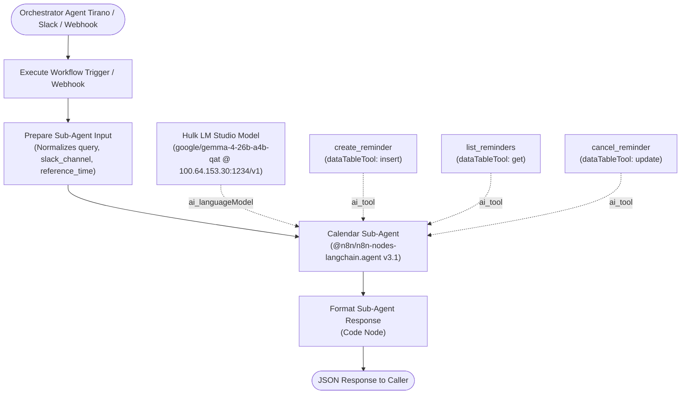

# Sub-Agent: Calendar & Task Manager (`sub-agent-calendar-manager`)

A dedicated, autonomous n8n sub-agent workflow designed for natural language calendar and reminder management. It integrates seamlessly with the primary **Tirano** Slack agent, storing all appointments, multi-tiered notifications, and tasks locally in n8n Data Tables with zero cloud calendar dependencies.

---

## 1. Architecture & System Topology



---

## 2. Technical Specifications

| Property | Specification |
| :--- | :--- |
| **Workflow ID** | `SJqxOcqXZ4WALQDz` |
| **Workflow Name** | `sub-agent-calendar-manager` |
| **Primary LLM** | `gemma-4-26b-a4b-qat` (hosted on Hulk via LM Studio at `http://100.64.153.30:1234/v1`) |
| **LLM Credential** | `hvK9eAePdrKHSgMD` (OpenAI Account on Hulk) |
| **Execution Timeout** | `600` seconds (cold-load tolerant with 360s model timeout) |
| **Data Storage** | n8n Data Table: `reminders` (Table ID: `SYBlBNK8FaTVTDdc`) |

---

## 3. Data Table Schema (`reminders`)

| Column Name | Data Type | Description / Constraints |
| :--- | :--- | :--- |
| `id` | `number` | Built-in unique row identifier |
| `task` | `string` | Description of event/task (e.g., `"Feed the dogs"`, `"Call Joseph"`) |
| `target_time` | `date` | Absolute ISO 8601 timestamp of actual event |
| `notify_time` | `date` | Exact ISO 8601 timestamp when alert must trigger |
| `offset_label` | `string` | Human-readable timing tag (e.g., `"1 week before"`, `"1 day before"`, `"event time"`) |
| `status` | `string` | Status indicator: `"pending"`, `"completed"`, or `"cancelled"` |
| `slack_channel` | `string` | Target Slack channel ID or user DM ID |

---

## 4. Sub-Agent Tools & Capabilities

1. **`create_reminder` (`n8n-nodes-base.dataTableTool` v1.1)**:
   - **Operation**: `insert`
   - **Schema**: Maps dynamic values from AI (`$fromAI`) for `task`, `target_time`, `notify_time`, `offset_label`, `status`, and `slack_channel`.
   - **Multi-Tiered Offset Logic**: When a request specifies multiple alert thresholds (e.g. "remind me 1 week and 1 day before"), the agent invokes `create_reminder` multiple times: once for each advance alert, plus once for the event time.

2. **`list_reminders` (`n8n-nodes-base.dataTableTool` v1.1)**:
   - **Operation**: `get`
   - **Return All**: `true`
   - **Description**: Retrieves all existing rows from the `reminders` table for schedule inspection.

3. **`cancel_reminder` (`n8n-nodes-base.dataTableTool` v1.1)**:
   - **Operation**: `update`
   - **Filter**: Matches row by `id`
   - **Action**: Sets `status` to `"cancelled"`.

---

## 5. Workflow Interface (Contract)

### Inputs
When invoked by parent orchestrator (e.g. Tirano via `executeWorkflow`):
```json
{
  "query": "On Jan 5 2028 remind me to call Joseph, remind me 1 week and 1 day before",
  "slack_channel": "C0123456789",
  "reference_time": "2026-09-04T01:30:00.000Z"
}
```

### Outputs
Formatted response returned to caller:
```json
{
  "status": "success",
  "query": "On Jan 5 2028 remind me to call Joseph, remind me 1 week and 1 day before",
  "response": "I've set up three reminders for \"call Joseph\" on January 5, 2028:\n- **1 week before**: 2027-12-29 at 09:00:00 UTC\n- **1 day before**: 2028-01-04 at 09:00:00 UTC\n- **At event time**: 2028-01-05 at 09:00:00 UTC",
  "timestamp": "2026-09-04T06:33:39.960Z"
}
```

---

## 6. Verification & Test Evidence

| Test ID | Input Query | Verification Result | Status |
| :--- | :--- | :--- | :--- |
| **TC-01** | `"Remind me to feed the dogs in 10 minutes"` | Created single row in `reminders` table with calculated `notify_time` 10 minutes ahead. | **PASSED** |
| **TC-02** | `"On Jan 5 2028 remind me to call Joseph, remind me 1 week and 1 day before"` | Created 3 discrete rows: `2027-12-29` (1 week before), `2028-01-04` (1 day before), `2028-01-05` (event time). | **PASSED** |
| **TC-03** | `"What reminders do I have pending?"` | Queried table and listed all 3 pending events with calculated times. | **PASSED** |
| **TC-04** | `"Cancel the reminder with ID 5"` | Successfully updated row 5 status to `"cancelled"`. | **PASSED** |
