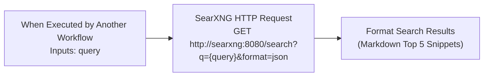

# Workflow: Tool-SearXNG-Search

A dedicated sub-workflow serving as a reusable AI Agent Web Search Tool via **SearXNG** (`http://searxng:8080`).

---

## 1. Overview & Specifications

| Property | Value |
| :--- | :--- |
| **Workflow Name** | `Tool-SearXNG-Search` |
| **Remote ID** | `hk8OViFZWBnveSCF` |
| **Default State** | `active: true` (Must remain active to serve as a callable sub-workflow tool) |
| **Trigger Type** | `When Executed by Another Workflow` (`executeWorkflowTrigger` v1.1) |
| **Required Inputs** | `query` (string) |
| **Output** | `response` (formatted Markdown text of top 5 search results), `query` |
| **Direct Canvas Link** | [https://n8n.local-n8n.com/workflow/hk8OViFZWBnveSCF](https://n8n.local-n8n.com/workflow/hk8OViFZWBnveSCF) |

---

## 2. Architecture & Topology

---

## 3. How to Connect to Any AI Agent in n8n

1. Add a **Call n8n Workflow Tool** (`@n8n/n8n-nodes-langchain.toolWorkflow`) to your workflow canvas.
2. Configure parameters:
   - **Name**: `searxng_web_search`
   - **Description**: `Search the live web using SearXNG for current news, real-time facts, water levels, weather, recent developments, or documentation. Input is a search query string.`
   - **Workflow ID**: Select `Tool-SearXNG-Search` (`hk8OViFZWBnveSCF`).
   - **Workflow Inputs**:
     - Mode: `Define below`
     - Parameter: `query` = `={{ /* n8n-auto-generated-fromAI-override */ $fromAI("query", "The search query string to look up", "string") }}`
3. Connect the tool's `ai_tool` output to the `AI Agent`'s `ai_tool` input port.
